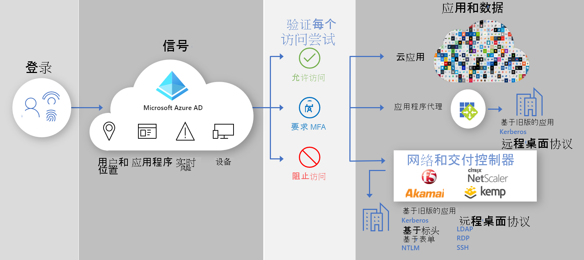

# 安全混合访问：使用 Azure Active Directory 保护旧应用

你现在可以通过将本地和云旧式身份验证应用程序连接到 Azure Active Directory (AD) 来保护这些应用程序：

- [Azure AD 应用程序代理](#secure-hybrid-access-sha-through-azure-ad-application-proxy)

- [现有的应用程序传送控制器和网络](#sha-through-networking-and-delivery-controllers)

- [虚拟专用网络 (VPN) 并 Software-Defined 外围网络 (SDP) 应用程序](#sha-through-vpn-and-sdp-applications)

您可以通过 Azure AD [条件性访问](../conditional-access/overview.md) 和 Azure AD [Identity Protection](../identity-protection/overview-identity-protection.md)等 Azure AD 功能，在所有应用程序中弥补缺口并增强安全状况。

## 通过 Azure AD 应用程序代理 (SHA) 安全混合访问
  
使用 [应用程序代理](./what-is-application-proxy.md) 可以提供对本地 web 应用程序的 [安全远程访问](./application-proxy.md) 。 用户不需要使用 VPN。 在 [单一登录](./add-application-portal-setup-sso.md)后，用户可以轻松地从任何设备连接到其应用程序。 应用程序代理将远程访问作为一项服务提供，可让你 [轻松地将本地应用程序发布](./application-proxy-add-on-premises-application.md) 给公司网络外部的用户。 它可帮助你扩展云访问管理，而无需修改你的本地应用程序。 作为下一步，[计划 Azure AD 应用程序代理部署](./application-proxy-deployment-plan.md)。

## Azure AD 合作伙伴集成

### SHA 到网络和传递控制器

除了 [Azure AD 应用程序代理](./what-is-application-proxy.md)外，使你能够使用 [零信任框架](https://www.microsoft.com/security/blog/2020/04/02/announcing-microsoft-zero-trust-assessment-tool/)，以及与第三方提供商的 Microsoft 合作伙伴。 你可以使用现有的网络和传递控制器，并轻松保护对你的业务流程至关重要但在 Azure AD 之前无法保护的旧版应用程序。 您已经拥有了开始保护这些应用程序所需的一切。

以下网络供应商提供预先构建的解决方案以及与 Azure AD 集成的详细指南。

- [Akamai 企业应用程序访问 (EAA)](../saas-apps/akamai-tutorial.md)

- [Citrix 应用程序传送控制器 (ADC)](../saas-apps/citrix-netscaler-tutorial.md)

- [F5 Big-IP APM](../saas-apps/headerf5-tutorial.md)

- [Kemp](../saas-apps/kemp-tutorial.md)

### SHA 到 VPN 和 SDP 应用程序

使用 VPN 和 SDP 解决方案，你可以随时在任何位置从任何设备对企业网络提供安全访问，同时保护组织的数据。 通过使 Azure AD 作为标识提供者 (IDP) ，你可以使用新式身份验证和授权方法（如 Azure AD [单一登录](./what-is-single-sign-on.md) 和 [多重身份验证](../authentication/concept-mfa-howitworks.md) ）来保护本地旧版应用程序。  

以下 VPN 和 SDP 供应商提供预先构建的解决方案和与 Azure AD 集成的详细指南。

• [Cisco AnyConnect](../saas-apps/cisco-anyconnect.md)

• [Fortinet](../saas-apps/fortigate-ssl-vpn-tutorial.md)

• [F5 大 IP APM](../saas-apps/headerf5-tutorial.md)

• [Palo Alto Networks 全局保护](../saas-apps/paloaltoadmin-tutorial.md)

• [Zscaler Private Access (ZPA) ](../saas-apps/zscalerprivateaccess-tutorial.md)