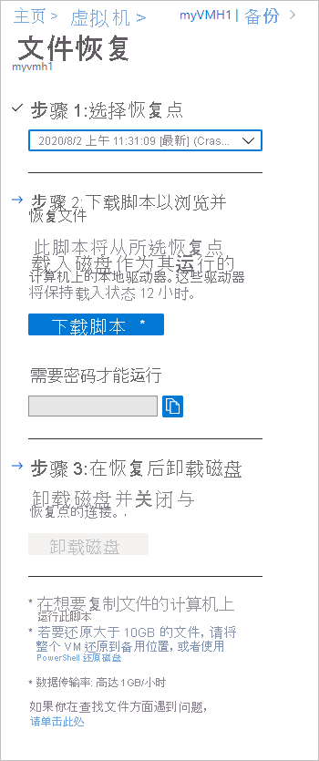
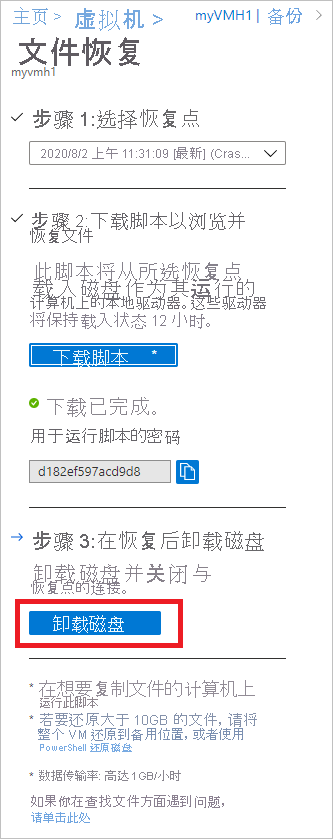

# <a name="recover-files-from-azure-virtual-machine-backup"></a>从 Azure 虚拟机备份恢复文件

Azure 备份提供从 Azure VM 备份（也称恢复点）还原 [Azure 虚拟机 (VM) 和磁盘](./backup-azure-arm-restore-vms.md)的功能。 本文介绍如何从 Azure VM 备份恢复文件和文件夹。 还原文件和文件夹仅适用于使用资源管理器模型部署的并在恢复服务保管库中受保护的 Azure VM。


> [!NOTE]
> 此功能适用于使用 Resource Manager 模型部署的、在恢复服务保管库中受保护的 Azure VM。
> 不支持从加密的 VM 备份恢复文件。
>


## <a name="step-1-generate-and-download-script-to-browse-and-recover-files"></a>步骤1：生成和下载脚本以浏览和恢复文件

若要从恢复点还原文件或文件夹，请在虚拟机上执行以下步骤：

1. 登录到 [Azure 门户](https://portal.Azure.com)，在左侧窗格中选择“虚拟机”。 从虚拟机列表中，选择虚拟机以打开其仪表板。

2. 在虚拟机菜单中，选择“备份”以打开“备份”仪表板。

    

3. 在“备份”仪表板菜单中，选择“文件恢复”。

    

    此时将打开“文件恢复”菜单。

    

4. 从“选择恢复点”下拉菜单中，选择存储所需文件的恢复点。 默认已选择最新的恢复点。

5. 选择 "下载 Windows Azure Vm 的 **可执行** (") 或下载适用于 Linux Azure Vm 的 **脚本** (，并) 下载用于从恢复点复制文件的软件。

    

    Azure 会将该可执行文件或脚本下载到本地计算机。

    

    若要以管理员身份运行可执行文件或脚本，建议将下载的文件保存到计算机。

6. 该可执行文件或脚本受密码保护，需要密码才能运行。 在“文件恢复”菜单中，选择复制按钮以将密码加载到内存中。

    


## <a name="step-2-ensure-the-machine-meets-the-requirements-before-executing-the-script"></a>步骤2：在执行脚本之前确保计算机满足要求

成功下载该脚本后，请确保具有正确的计算机来执行此脚本。 你计划在其中执行脚本的 VM 不应具有以下任何不支持的配置。 如果是这样，则从满足要求的同一区域中选择一个最好的计算机。  

### <a name="dynamic-disks"></a>动态磁盘

无法在具有以下任何特征的 VM 上运行可执行脚本：

- 跨多个磁盘 (跨区卷和带区卷) 的卷。
- 容错卷 (镜像卷和 RAID-5 卷) 在动态磁盘上。

### <a name="windows-storage-spaces"></a>Windows 存储空间

无法在为 Windows 存储空间配置的 VM 上运行下载的可执行文件。

### <a name="virtual-machine-backups-having-large-disks"></a>具有大型磁盘的虚拟机备份

如果备份的计算机上有大量磁盘 ( # B0 16) 或大磁盘 ( # A1 4 TB 每个) ，不建议在同一台计算机上执行该脚本以进行还原，因为这会对 VM 产生重大影响。 但建议仅为 Azure VM D2v3 Vm)  (的文件恢复使用单独的 VM，并在不需要时将其关闭。 

## <a name="step-3-os-requirements-to-successfully-run-the-script"></a>步骤3：成功运行脚本的操作系统要求

要在其上运行下载的脚本的 VM 必须满足以下要求。

### <a name="for-windows-os"></a>对于 Windows OS

下表显示了服务器与计算机操作系统之间的兼容性。 恢复文件时，不能将文件还原到更旧或更新的操作系统版本。 例如，不能将文件从 Windows Server 2016 VM 还原到 Windows Server 2012 或 Windows 8 计算机。 可将 VM 中的文件还原到相同的服务器操作系统，或还原到兼容的客户端操作系统。

|服务器 OS | 兼容的客户端 OS  |
| --------------- | ---- |
| Windows Server 2019    | Windows 10 |
| Windows Server 2016    | Windows 10 |
| Windows Server 2012 R2 | Windows 8.1 |
| Windows Server 2012    | Windows 8  |
| Windows Server 2008 R2 | Windows 7   |

### <a name="for-linux-os"></a>对于 Linux OS

在 Linux 中，用于还原文件的计算机的 OS 必须支持受保护虚拟机的文件系统。 选择用于运行脚本的计算机时，请确保计算机具有兼容的 OS，并使用下表中认定的版本之一：

|Linux OS | 版本  |
| --------------- | ---- |
| Ubuntu | 12.04 及更高版本 |
| CentOS | 6.5 及更高版本  |
| RHEL | 6.7 及更高版本 |
| Debian | 7 及更高版本 |
| Oracle Linux | 6.4 及更高版本 |
| SLES | 12 及更高版本 |
| openSUSE | 42.2 及更高版本 |

> [!NOTE]
> 我们发现，在使用 SLES 12 SP4 OS 的计算机上运行文件恢复脚本时会出现一些问题，我们正在与 SLES 团队一起调查这些问题。
> 目前，可在使用 SLES 12 SP2 和 SP3 OS 版本的计算机上正常运行文件恢复脚本。
>

该脚本还需要 Python 和 bash 组件才能执行并安全地连接到恢复点。

|组件 | 版本  |
| --------------- | ---- |
| bash | 4 及更高版本 |
| Python | 2.6.6 及更高版本  |
| TLS | 应支持 1.2  |

## <a name="step-4-access-requirements-to-successfully-run-the-script"></a>步骤4：访问要求以成功运行脚本

如果在访问受限的计算机上运行该脚本，请确保能够访问：

- `download.microsoft.com`
- 恢复服务 URL（地区名称指恢复服务保管库所在的区域）
  - `https://pod01-rec2.GEO-NAME.backup.windowsazure.com` Azure 公共区域的 () 
  - `https://pod01-rec2.GEO-NAME.backup.windowsazure.cn`（适用于 Azure 中国世纪互联）
  - `https://pod01-rec2.GEO-NAME.backup.windowsazure.us`（适用于 Azure 美国政府）
  - `https://pod01-rec2.GEO-NAME.backup.windowsazure.de`（适用于 Azure 德国）
- 出站端口 53 (DNS)、443、3260

> [!NOTE]
>
> 在 [上面](#step-1-generate-and-download-script-to-browse-and-recover-files) 的步骤1中下载的脚本文件将在该文件的名称中包含 **地理名称** 。 使用该地区名称填写 URL。 下载的脚本名称将以如下开头：\'VMname\'\_\'geoname\'_\'GUID\'。<br><br>
> 例如，如果脚本文件名为 " *ContosoVM_wcus_12345678*"，则 wcus **为，** URL 将 *wcus* 为：<br> <https://pod01-rec2.wcus.backup.windowsazure.com>
>

在 Linux 上，该脚本需要“open-iscsi”和“lshw”组件才能连接到恢复点。 如果这些组件不存在于运行脚本的计算机上，该脚本会请求权限以安装组件。 请同意安装必需组件。

需要访问 `download.microsoft.com`，才能下载用于在运行脚本的计算机与恢复点中的数据之间构建安全通道的组件。


## <a name="step-5-running-the-script-and-identifying-volumes"></a>步骤5：运行脚本并标识卷

### <a name="for-windows"></a>对于 Windows

满足步骤2、步骤3和步骤4中列出的所有要求后，请从下载位置复制脚本 (通常) 下载文件夹，右键单击该可执行文件或脚本，然后用管理员凭据运行该脚本。 出现提示时，键入密码或粘贴内存中的密码，然后按 Enter。 输入有效的密码后，脚本将连接到恢复点。

  


运行可执行文件时，操作系统将装载新卷并分配驱动器号。 可以使用 Windows 资源管理器或文件资源管理器来浏览这些驱动器。 分配给卷的驱动器号不能与原始虚拟机中的驱动器号相同。 不过，卷名会保留。 例如，如果原始虚拟机上的卷为“数据磁盘(E:`\`)”，可在本地计算机上将该卷附加为“数据磁盘(‘任意字母’:`\`)”。 浏览脚本输出中所述的所有卷，直至找到文件或文件夹。  

   

**对于具有大型磁盘的已备份 Vm (Windows)**

如果文件恢复过程在运行文件还原脚本后挂起 (例如，如果从未装载磁盘，或装载了卷但) 不显示卷，请执行以下步骤：
  
1. 确保 OS 为 WS 2012 或更高版本。
2. 确保在还原服务器中按以下建议设置注册表项，并确保重新启动服务器。 GUID 旁边的数字的范围为 0001 - 0005。 下面的示例中采用的是 0004。 浏览注册表项路径，直到参数部分。

    

```registry
- HKEY_LOCAL_MACHINE\SYSTEM\CurrentControlSet\Services\Disk\TimeOutValue – change this from 60 to 1200
- HKEY_LOCAL_MACHINE\SYSTEM\ControlSet001\Control\Class\{4d36e97b-e325-11ce-bfc1-08002be10318}\0003\Parameters\SrbTimeoutDelta – change this from 15 to 1200
- HKEY_LOCAL_MACHINE\SYSTEM\ControlSet001\Control\Class\{4d36e97b-e325-11ce-bfc1-08002be10318}\0003\Parameters\EnableNOPOut – change this from 0 to 1
- HKEY_LOCAL_MACHINE\SYSTEM\ControlSet001\Control\Class\{4d36e97b-e325-11ce-bfc1-08002be10318}\0003\Parameters\MaxRequestHoldTime - change this from 60 to 1200
```

### <a name="for-linux"></a>对于 Linux

对于 Linux 计算机，将生成一个 Python 脚本。 下载该脚本并将其复制到相关兼容的 Linux 服务器。 你可能必须修改权限才能使用 ```chmod +x <python file name>``` 执行该脚本。 然后使用 ```./<python file name>``` 运行 Python 文件。


在 Linux 中，恢复点的卷会装载到运行脚本的文件夹。 将相应地显示附加的磁盘、卷和对应装载路径。 这些装载路径对于具有根级别访问权限的用户可见。 浏览脚本输出中涉及的卷。

  


**对于具有大型磁盘的已备份 Vm (Linux)**

如果文件恢复过程在运行文件还原脚本后挂起 (例如，如果从未装载磁盘，或装载了卷但) 不显示卷，请执行以下步骤：

1. 在文件 /etc/iscsi/iscsid.conf 中，将设置从
    - `node.conn[0].timeo.noop_out_timeout = 5` 更改为 `node.conn[0].timeo.noop_out_timeout = 30`
2. 进行上述更改后，重新运行脚本。 如果发生暂时性故障，请确保重新运行之间存在20到30分钟的间隔，以避免连续突发的请求影响目标准备。 重新运行之间的间隔将确保目标已准备好从脚本进行连接。
3. 在执行文件恢复后，请务必返回门户并为无法装载卷的恢复点选择“卸载磁盘”。 从本质上来说，此步骤将清理所有现有进程/会话并提高恢复的可能性。


#### <a name="lvmraid-arrays-for-linux-vms"></a>适用于 Linux Vm) 的 LVM/RAID 阵列 (

在 Linux 中，逻辑卷管理器 (LVM) 和/或软件 RAID 阵列用于管理多个磁盘上的逻辑卷。 如果受保护的 Linux VM 使用 LVM 和/或 RAID 阵列，则不能在同一 VM 上运行该脚本。<br>
而应在具有兼容 OS 且支持受保护 VM 的文件系统的任何其他计算机上运行该脚本。<br>
以下脚本输出显示了 LVM 和/或 RAID 阵列磁盘和卷，及其分区类型。

   

若要使这些分区联机，请运行以下各部分中的命令。

#### <a name="for-lvm-partitions"></a>对于 LVM 分区

运行脚本后，LVM 分区会在脚本输出中指定的物理卷/磁盘中装载。 该过程旨在

1. 获取物理卷或磁盘中卷组名称的唯一列表
2. 然后列出这些卷组中的逻辑卷
3. 然后将逻辑卷装载到所需的路径。

##### <a name="listing-volume-group-names-from-physical-volumes"></a>列出物理卷中的卷组名称

若要列出卷组名称，请执行以下操作：

```bash
pvs -o +vguuid
```

此命令将列出所有物理卷（包括运行脚本之前存在的物理卷）、其相应的卷组名称以及卷组的唯一用户 ID (UUID)。 该命令的示例输出如下所示。

```bash
PV         VG        Fmt  Attr PSize   PFree    VG UUID

  /dev/sda4  rootvg    lvm2 a--  138.71g  113.71g EtBn0y-RlXA-pK8g-de2S-mq9K-9syx-B29OL6

  /dev/sdc   APPvg_new lvm2 a--  <75.00g   <7.50g njdUWm-6ytR-8oAm-8eN1-jiss-eQ3p-HRIhq5

  /dev/sde   APPvg_new lvm2 a--  <75.00g   <7.50g njdUWm-6ytR-8oAm-8eN1-jiss-eQ3p-HRIhq5

  /dev/sdf   datavg_db lvm2 a--   <1.50t <396.50g dhWL1i-lcZS-KPLI-o7qP-AN2n-y2f8-A1fWqN

  /dev/sdd   datavg_db lvm2 a--   <1.50t <396.50g dhWL1i-lcZS-KPLI-o7qP-AN2n-y2f8-A1fWqN
```

第一列 (PV) 显示物理卷，后续列显示相关的卷组名称、格式、属性、大小、可用空间以及卷组的唯一 ID。 命令输出显示所有物理卷。 请参阅脚本输出，并确定与备份相关的卷。 在上面的示例中，脚本输出将显示 /dev/sdf 和 /dev/sdd。 因此，datavg_db 卷组属于脚本，而 Appvg_new 卷组属于计算机。 最终想法是确保唯一的卷组名称具有一个唯一 ID。

###### <a name="duplicate-volume-groups"></a>重复卷组

在某些方案中，卷组名称在运行脚本后可能具有 2 个 UUID。 这意味着执行脚本的计算机中的卷组名称与备份 VM 中的卷组名称相同。 接下来，我们需要重命名备份 VM 卷组。 请查看下面的示例。

```bash
PV         VG        Fmt  Attr PSize   PFree    VG UUID

  /dev/sda4  rootvg    lvm2 a--  138.71g  113.71g EtBn0y-RlXA-pK8g-de2S-mq9K-9syx-B29OL6

  /dev/sdc   APPvg_new lvm2 a--  <75.00g   <7.50g njdUWm-6ytR-8oAm-8eN1-jiss-eQ3p-HRIhq5

  /dev/sde   APPvg_new lvm2 a--  <75.00g   <7.50g njdUWm-6ytR-8oAm-8eN1-jiss-eQ3p-HRIhq5

  /dev/sdg   APPvg_new lvm2 a--  <75.00g  508.00m lCAisz-wTeJ-eqdj-S4HY-108f-b8Xh-607IuC

  /dev/sdh   APPvg_new lvm2 a--  <75.00g  508.00m lCAisz-wTeJ-eqdj-S4HY-108f-b8Xh-607IuC

  /dev/sdm2  rootvg    lvm2 a--  194.57g  127.57g efohjX-KUGB-ETaH-4JKB-MieG-EGOc-XcfLCt
```

脚本输出将显示附加了 /dev/sdg、/dev/sdh、/dev/sdm2。 因此，相应的 VG 名称为 Appvg_new 和 rootvg。 但是，计算机的 VG 列表中也存在相同的名称。 我们可以验证一个 VG 名称是否具有两个 UUID。

现在，我们需要为基于脚本的卷重命名 VG 名称，例如：/dev/sdg、/dev/sdh、/dev/sdm2。 若要重命名卷组，请使用以下命令

```bash
vgimportclone -n rootvg_new /dev/sdm2
vgimportclone -n APPVg_2 /dev/sdg /dev/sdh
```

现在，我们拥有所有具有唯一 ID 的 VG 名称。

###### <a name="active-volume-groups"></a>活动卷组

确保与脚本卷相对应的卷组处于活动状态。 以下命令用于显示活动卷组。 检查此列表中是否存在脚本的相关卷组。

```bash
vgdisplay -a
```  

否则，请使用以下命令激活卷组。

```bash
#!/bin/bash
vgchange –a y  <volume-group-name>
```

##### <a name="listing-logical-volumes-within-volume-groups"></a>列出卷组中的逻辑卷

获得与脚本相关的 VG 的唯一活动列表后，便可以使用以下命令列出这些卷组中存在的逻辑卷。

```bash
#!/bin/bash
lvdisplay <volume-group-name>
```

此命令将每个逻辑卷的路径显示为“LV 路径”。

##### <a name="mounting-logical-volumes"></a>装载逻辑卷

将逻辑卷装载到所选的路径：

```bash
#!/bin/bash
mount <LV path from the lvdisplay cmd results> </mountpath>
```

> [!WARNING]
> 不要使用“mount -a”。 此命令会装载“/etc/fstab”中描述的所有设备。 这可能意味着可能会装载重复的设备。 数据可以重定向到脚本创建的设备，这些设备不会保留数据，因此可能会导致数据丢失。

#### <a name="for-raid-arrays"></a>对于 RAID 阵列

以下命令显示有关所有 RAID 磁盘的详细信息：

```bash
#!/bin/bash
mdadm –detail –scan
```

 相关 RAID 磁盘显示为 `/dev/mdm/<RAID array name in the protected VM>`

如果 RAID 磁盘具有物理卷，请使用 mount 命令：

```bash
#!/bin/bash
mount [RAID Disk Path] [/mountpath]
```

如果 RAID 磁盘中配置了另一 LVM，请使用前述 LVM 分区相关过程，但使用卷名称代替 RAID 磁盘名称。

## <a name="step-6-closing-the-connection"></a>步骤6：关闭连接

识别文件并将其复制到本地存储位置后，请删除（或卸载）其他驱动器。 若要卸载驱动器，请在 Azure 门户中的“文件恢复”菜单上，选择“卸载磁盘”。 



卸载磁盘后，将收到一条消息。 连接可能在几分钟时间后才会刷新，以便能够删除磁盘。

在 Linux 中，断开与恢复点的连接后，OS 不会自动删除相应装载路径。 装载路径作为“孤立”的卷存在并且可见，但访问/写入文件时会引发错误。 这些卷可以手动删除。 该脚本运行时会标识以前的任何恢复点存在的任何此类卷，并在获得许可后将其清除。

> [!NOTE]
> 还原所需的文件后，请确保关闭连接。 这一点很重要，尤其是在执行脚本的计算机还进行了备份配置的方案中。 如果连接仍处于打开状态，则后续备份可能会失败，并显示错误“UserErrorUnableToOpenMount”。 出现这种情况是因为已装载的驱动器/卷被假定为可用，并且在访问时它们可能会因为基础存储（即 iSCSI 目标服务器）可能不可用而失败。 清理连接将删除这些驱动器/卷，因此它们在备份期间将不可用。

## <a name="security"></a>安全性

本部分介绍从 Azure VM 备份进行文件恢复时采取的各种安全措施。

### <a name="feature-flow"></a>功能流

构建此功能是为了在不需要还原整个 VM 或 VM 磁盘的情况下访问 VM 数据，同时尽量减少步骤数。 对 VM 数据的访问权限由脚本（在按如下方式运行时会装载恢复卷）提供，因此它是所有安全实现的基础：

  

### <a name="security-implementations"></a>安全实现

#### <a name="select-recovery-point-who-can-generate-script"></a>选择恢复点（谁可以生成脚本）

此脚本可以访问 VM 数据，必须控制谁可以首先生成它，这很重要。 需要登录到 Azure 门户，并 [获得 AZURE RBAC 授权](backup-rbac-rs-vault.md#mapping-backup-built-in-roles-to-backup-management-actions) ，以便生成脚本。

文件恢复所需的授权级别与 VM 还原和磁盘还原相同。 换句话说，只有经过授权的用户才能查看 VM 数据和生成脚本。

生成的脚本使用适用于 Azure 备份服务的 Microsoft 官方证书签名。 篡改此脚本意味着破坏签名，尝试运行此脚本会被 OS 突出显示为潜在的风险。

#### <a name="mount-recovery-volume-who-can-run-script"></a>装载恢复卷（谁可以运行脚本）

只有管理员可以运行此脚本，并且应该以提升模式运行它。 此脚本仅运行预先生成的一组步骤，不接受任何外部源的输入。

若要运行脚本，需要使用在 Azure 门户或 PowerShell/CLI 中生成脚本时仅向授权用户显示的密码。 这是为了确保下载该脚本的授权用户同时负责运行该脚本。

#### <a name="browse-files-and-folders"></a>浏览文件和文件夹

为了浏览文件和文件夹，该脚本使用计算机中的 iSCSI 发起程序并连接到配置为 iSCSI 目标的恢复点。 此处，你可以想象用户尝试模拟/仿冒任一/所有组件的情景。

我们使用 CHAP 相互身份验证机制，让每个组件相互进行身份验证。 这意味着，身份虚假的发起程序很难连接到 iSCSI 目标，虚假目标也很难连接到运行脚本的计算机。

恢复服务与计算机之间的数据流由通过 TCP 构建安全 TLS 隧道提供保护（在运行脚本的计算机上[应支持 TLS 1.2](#step-3-os-requirements-to-successfully-run-the-script)）。

父级/备份 VM 中存在的任何文件访问控制列表 (ACL) 也会保留在已装载的文件系统中。

此脚本提供对恢复点的只读访问权限，并且仅在 12 小时内有效。 如果要提前删除访问权限，请登录 Azure 门户/PowerShell/CLI，并对特定恢复点执行“卸载磁盘”操作。 脚本将立即失效。


## <a name="next-steps"></a>后续步骤

- 了解如何[通过 PowerShell 还原文件](./backup-azure-vms-automation.md#restore-files-from-an-azure-vm-backup)
- 了解如何[通过 Azure CLI 还原文件](./tutorial-restore-files.md)
- 恢复 VM 后，了解如何[管理备份](./backup-azure-manage-vms.md)
