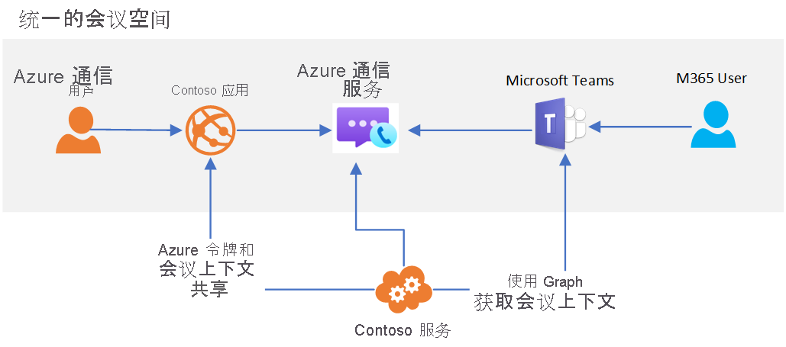

# Teams 互操作性

[!INCLUDE [Private Preview Notice](../../includes/private-preview-include.md)]

Azure 通信服务可用于构建与 Microsoft Teams 交互的自定义会议体验。 通信服务解决方案用户可以通过语音、视频和屏幕共享与 Teams 参与者进行交互。

借助这种互操作性，可创建将用户连接到 Teams 会议的自定义 Azure 应用程序。 自定义应用程序的用户无需 Azure Active Directory 标识或 Teams 许可证即可体验此功能。 这非常适合用于让员工（可能熟悉 Teams）和外部用户（使用自定义应用程序体验）一起加入流畅的会议体验。 这样就可以生成与下面类似的体验：

1. 员工使用 Teams 安排会议
2. 自定义通信服务应用程序使用 Microsoft Graph API 来访问会议详细信息
3. 通过自定义应用程序与外部用户共享会议详细信息
4. 外部用户使用你的自定义应用程序加入 Teams 会议（通过通信服务呼叫客户端库）

此用例的概要结构如下所示： 

尽管某些 Teams 会议功能（如举手、同聚一堂模式和分组讨论室）只可供 Teams 用户使用，但你的自定义应用程序可以访问会议的核心音频、视频和屏幕共享功能。

当通信服务用户加入 Teams 会议时，通过呼叫客户端库提供的显示名称将向 Teams 用户显示。 否则，通信服务用户将被视为 Teams 中的匿名用户。 自定义应用程序应考虑使用用户身份验证和其他安全措施来保护 Teams 会议。 请注意允许匿名用户加入会议的安全影响，并使用 [Teams 安全指南](https://docs.microsoft.com/microsoftteams/teams-security-guide#addressing-threats-to-teams-meetings)配置匿名用户可用的功能。

只要在[会议设置](https://docs.microsoft.com/microsoftteams/meeting-settings-in-teams)中启用了匿名加入，通信服务用户就可以加入计划的 Teams 会议。

## 后续步骤

> [!div class="nextstepaction"]
> [在 Teams 会议中加入通话应用](../../quickstarts/voice-video-calling/get-started-teams-interop.md)
