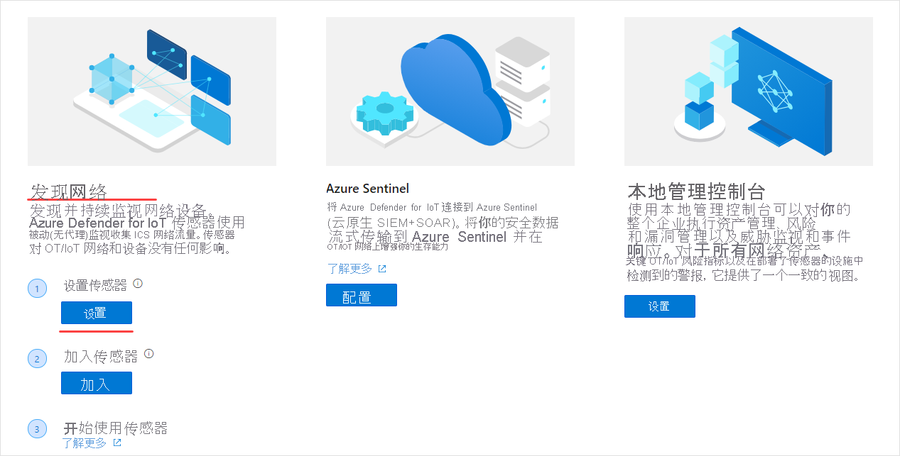
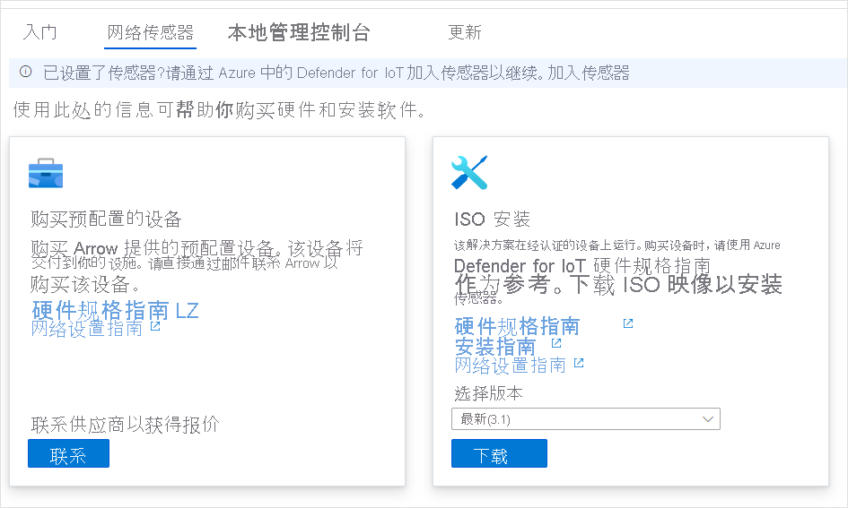
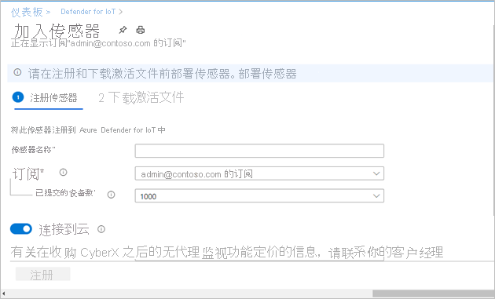
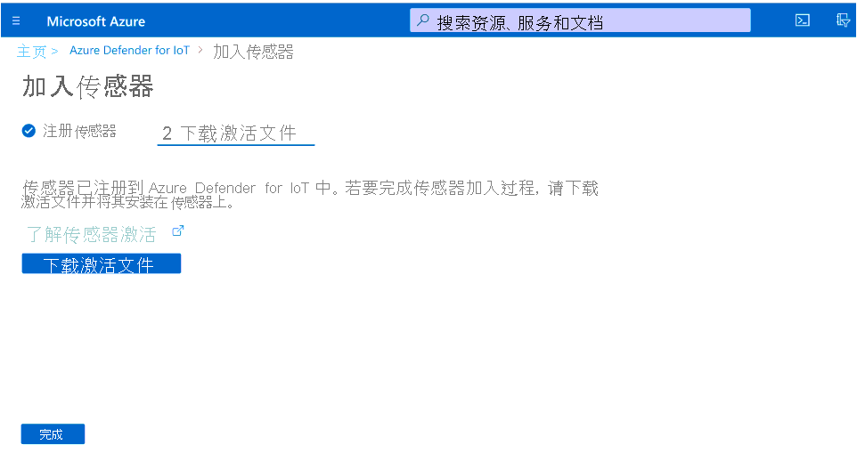
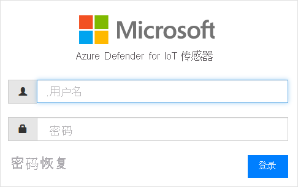
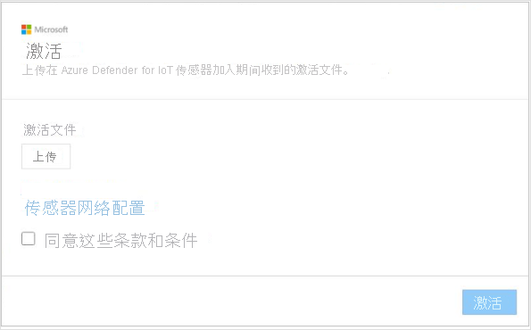
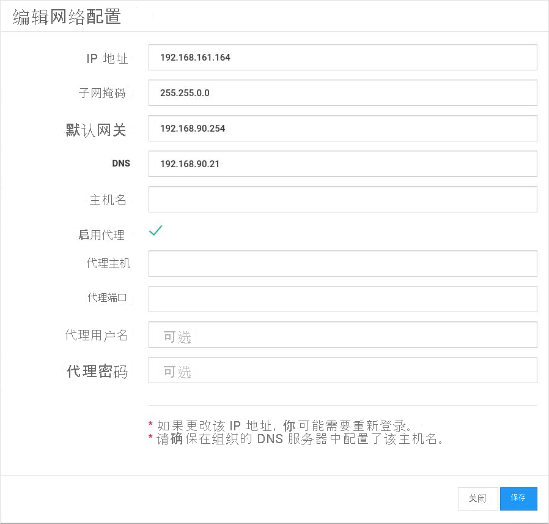

# 快速入门：部署和加入传感器

本文提供传感器部署过程的概述。 必须将传感器加入 Azure Defender for IoT 门户。

此过程需要获取预配置的传感器或获取经认证的传感器设备并自行安装传感器软件。

如果使用经认证的传感器设备，则建议在开始之前查看 [Azure Defender for IoT hardware specifications guide](https://aka.ms/AzureDefenderforIoTBareMetalAppliance)（Azure Defender for IoT 硬件规范指南）。

> [!NOTE]
> 无需加入 Azure Defender for IoT 本地管理控制台。

加入传感器后，你将能够：

|||
|------ | ----------- |
| 定义传感器名称 | 命名加入的传感器，并将其与 IoT 中心或订阅相关联。  有关详细信息，请参阅“加入传感器”。|
|选择订阅和已提交的设备数|选择订阅和订阅所涵盖的设备数。 以 1000 为增量输入该数字。|
| 定义传感器管理模式 | 定义传感器检测到的资产、警报和其他信息的显示位置。 这取决于你定义的传感器管理模式。  本地托管模式：传感器检测到的信息显示在传感器控制台中。 如果传感器连接到本地管理控制台，则还会与本地管理控制台共享检测信息。  云托管模式：传感器检测到的信息显示在传感器控制台中。 此外，警报信息通过 IoT 中心传送，并且可与其他 Azure 服务（例如 Azure Sentinel）共享。 有关详细信息，请参阅“加入传感器”。 |
| 获取传感器激活文件 | 对于本地托管的传感器，激活文件用于管理经授权的传感器激活时间段。  对于云托管的传感器，激活文件用作传感器与 IoT 中心之间的连接。 有关详细信息，请参阅“加入传感器”。 |
| 将激活文件上传到传感器 | 激活文件必须上传到企业传感器。 在上传激活文件之前，网络监视和对传感器控制台功能的访问将不可用。 有关更多详细信息，请参阅“上传传感器激活文件”。 |
| 激活前更新传感器网络参数 | 更新在传感器安装过程中定义的参数。 有关更多详细信息，请参阅“上传传感器激活文件”。|

若要部署传感器：

1. 从 Azure 门户转到 Azure Defender for IoT。

2. 选择“开始”。

3. 在“发现网络”部分中，选择“设置” 。

   

4. 选择用于获取传感器的选项。

   

  - 购买预配置的传感器：Microsoft 与 Arrow 合作，以提供预配置的传感器。 若要购买预配置的传感器，请通过以下方式与 Arrow 联系：<hardware.sales@arrow.com>。 传感器将交付到你的设施。 已安装最新版本。

  - 自带设备（ISO 安装）：解决方案在经认证的设备上运行。 购买经认证的设备时，请使用 [Azure Defender for IoT hardware specifications guide](https://aka.ms/AzureDefenderforIoTBareMetalAppliance)（Azure Defender for IoT 硬件规范指南）作为参考。

    - 从“选择版本”菜单中选择一个版本。

    - 选择“下载”并保存文件。 有关下载 ISO 映像和安装传感器软件的详细信息，请参阅“Azure Defender for IoT 安装指南”。

5. 在传感器上安装软件或在收到预配置的传感器之后，执行网络设置任务。 有关详细信息，请参阅[网络设置指南](https://aka.ms/AzureDefenderForIoTNetworkSetup)。

## 加入传感器

需要将传感器加入 Azure Defender for IoT 门户。 加入操作分两个阶段进行：

1. 向 Azure Defender for IoT 门户注册传感器。

2. 为传感器下载激活文件。 稍后会将该文件上传到传感器。

若要访问加入页面：

1. 导航到 Microsoft Azure Defender for IoT“开始”页面。

2. 从 Azure Defender for IoT 选择“2) 加入”。

   

3. 此时将打开“加入传感器”页面。 该页面提供用于注册传感器和下载激活文件的选项。

   

若要注册传感器：

1. 选择传感器名称。 对于云托管的传感器，此处定义的名称应用于传感器控制台中显示的名称：无法从控制台中更改此名称。 对于本地托管的传感器，此处应用的名称将存储在 Azure 中，但可以在传感器控制台中进行更新。 建议在名称中包含安装的传感器的 IP 地址，或使用易于识别的名称。 这将确保更轻松地跟踪 Azure Defender for IoT 门户中的注册名称和传感器控制台中显示的已部署传感器的 IP，并确保这两者之间的命名一致。

2. 从“订阅”下拉列表中选择一个订阅。
3. 在“提交的设备”字段中，输入订阅所涵盖的设备数。 应该为与同一订阅相关联的所加入的每个传感器重新输入此数字。  例如，如果订阅“A”与 6000 台设备相关联，则为与订阅“A”相关联的每个传感器输入 6000。   
4. 使用“云连接”切换开关选择传感器管理模式。 如果该切换开关打开，则传感器为“云托管”。 如果该切换开关关闭，则传感器为“本地托管”。

| 传感器管理模式 | 说明                                                |
| ---------------------- | ---------------------------------------------------------  |
| 云托管          | 传感器检测到的信息显示在传感器控制台中。 此外，警报信息通过 IoT 中心传送，并且可与其他 Azure 服务（例如 Azure Sentinel）共享。  选择要与此传感器关联的 IoT 中心。  需要将云托管的激活文件上传到云托管的传感器。  有关详细信息，请参阅“上传传感器激活文件”。 |
| 本地托管        | 本地托管的传感器检测到的信息显示在传感器控制台中。 如果使用气隙网络，并且想要统一查看由多个本地托管的传感器检测到的所有信息，请使用本地管理控制台。  本地托管的传感器与 Azure 订阅相关联，并且包含有关传感器激活过期时间的说明。  选择要与此传感器关联的订阅。  需要将本地托管的激活文件上传到每个传感器。有关详细信息，请参阅“上传传感器激活文件”。 |

5. 选择“注册”  。

6. 在“下载激活文件”页面中，选择“下载激活文件”。

   

7. 保存文件。 文件名的格式为：`<hub_name>_<sensor_name>`。 传感器名称是指前面定义的名称。

8. 选择“完成”。

9. 若要完成传感器加入过程，请从 Azure Defender for IoT 控制台将该文件上传到传感器。
 
## 上传传感器激活文件

本文介绍如何将激活文件上传到传感器。 加入传感器时，你应该已接收到该文件。

本地托管的激活文件

本地托管的传感器与 Azure 订阅相关联。  本地托管的传感器的激活文件包含到期日期。 此日期前一个月，传感器控制台的顶部会出现一条警告消息。 更新激活文件之后，该警告才会消失。

可在激活文件过期后继续使用 Azure Defender for IoT 功能。

云托管的激活文件

云托管的传感器与 Azure IoT 中心相关联。 这些传感器不受激活文件时间段的限制。 云托管的传感器的激活文件用于确保连接到 IoT 中心。

有关 IoT 中心的详细信息，请参阅 [IoT 中心简介](../iot-hub/about-iot-hub.md)。

若要上传激活文件：

1. 验证你是否具有：

   - 传感器的 IP 地址 - 在安装过程中定义

   - 传感器所需的用户登录凭据

2. 使用此传感器的 IP 地址从浏览器访问 Azure Defender for IoT 控制台。

3. 登录到 Azure Defender for IoT 传感器控制台。

   

4. 成功登录后，将随即打开“激活”屏幕。 选择“上传”，然后选择所保存的激活文件。

   

5. 同意条款和条件。

6. 选择“激活”。 传感器网络配置参数已在软件安装过程中或在购买预配置的传感器时定义。 已定义以下参数：
   - IP 地址
   - DNS  
   - 默认网关
   - 子网掩码
   - 主机名
 
   在激活传感器之前，可能需要更新此信息，原因如下：
   - 需要更改定义的预配置参数  
   - 想要在安装后重新配置网络参数 还可以在激活传感器之前定义代理设置。

7. 从“激活”对话框中选择“传感器网络配置”链接。  

   

8. 将显示在安装过程中定义的参数。 还可以使用“定义代理”选项。 根据需要进行更新，并选择“保存”。
 
 
## 后续步骤

本文介绍了如何部署和加入传感器。 要详细了解如何开始使用，请参阅以下文章：

- [入门](getting-started.md)
