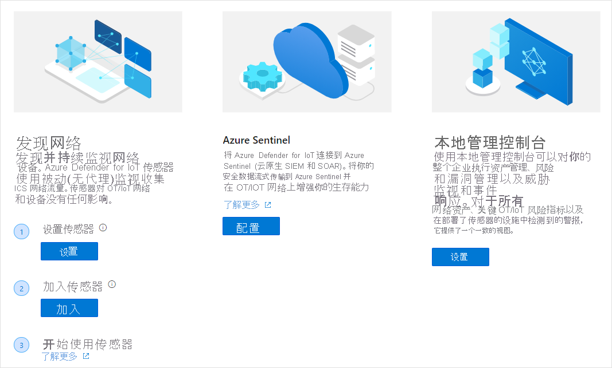

# 快速入门：为 Azure Defender for IoT 部署准备网络

## 选择硬件
Azure Defender for IoT 支持多种认证设备，包括：
- 预配置认证设备，已在其上安装软件
- 未配置的认证设备，可在其上下载和安装传感器软件
- 本地管理控制台设备规范。 本地管理控制台不可作为预配置的设备。 

有关详细信息，请参阅[硬件规范指南](https://aka.ms/AzureDefenderforIoTBareMetalAppliance)

## 安装组件
从 Azure Defender for IoT 门户获取硬件组件并下载软件包后，可以安装组件软件。 有关详细信息，请参阅[安装指南](https://aka.ms/AzureDefenderforIoTInstallSensorISO)。

## 将传感器加入 Azure Defender for IoT 门户 
 本文概述了 Azure Defender for IoT 传感器和本地管理控制台的部署、加入和更新过程。 此过程按照“欢迎使用 Azure Defender for IoT”页和后续页面中的说明执行。

打开欢迎页：

1. 登录 Azure 帐户，并搜索 Azure Defender for IoT。

1. 传感器部署需要执行以下任一操作：单击箭头购买预配置的硬件，或购买自己的设备并在其上安装传感器软件。
1. 本地管理控制台部署需要你购买自己的设备并在其上安装本地管理控制台软件。 有关详细信息，

## 网络设置
安装 Defender for IoT 系统组件后，可以配置网络设备以实现最佳网络监视。 有关详细信息，请参阅[网络设置指南](https://aka.ms/AzureDefenderForIoTNetworkSetup)。   

## 后续步骤

本文介绍了如何准备使用 Defender for IoT。 要详细了解如何开始使用，请参阅以下文章：

- [入门](getting-started.md)