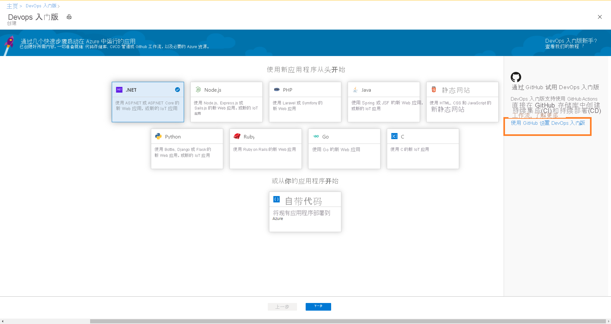

# 使用 GitHub Actions 通过 DevOps Starter 设置适用于 Node.js 应用的 CI/CD

在本快速入门中，将通过简化的 DevOps Starter 体验，使用 GitHub Actions 为 Node.js 应用程序设置持续集成 (CI) 和持续交付 (CD) 工作流。 可以使用 DevOps Starter 来设置开发、部署和监视应用所需的全部设置。 

## 必备条件

- 具有活动订阅的 Azure 帐户。 [免费创建帐户](https://azure.microsoft.com/free/?ref=microsoft.com&utm_source=microsoft.com&utm_medium=docs&utm_campaign=visualstudio)。 
- [GitHub](https://github.com/) 帐户。

## 登录到 Azure 门户

DevOps Starter 使用 GitHub Actions 创建 CI/CD 工作流。 DevOps 入门版还将在所选的 Azure 订阅中创建 Azure 资源。

1. 登录 [Azure 门户](https://portal.azure.com)。

1. 在搜索框中键入“DevOps 入门版”，然后选择。 单击“添加”以新建一个。

    

## 选择示例应用程序和 Azure 服务

1. 在右侧横幅上，单击“使用 GitHub 设置 DevOps Starter”。

    

1. 确保选择 CI/CD 提供程序作为 GitHub Actions。

    

1. 选择 **Node.js** 示例应用程序。 Node.js 示例包括一个选项，可以从多个应用程序框架中进行选择。

1. 默认的示例框架为 **Express.js** 。 保留默认设置，然后选择“下一步”。   

2. Windows Web 应用是默认的部署目标。 以前选择的应用程序框架规定了此处提供的 Azure 服务部署目标的类型。 保留默认服务，然后选择“下一步”。
 
## 配置 GitHub 帐户和 Azure 订阅 

1. 使用 GitHub 进行身份验证。

   1. 单击“授权”按钮。 
   
   1. 登录 GitHub。 如果没有 GitHub 帐户，也可以在此处注册。

2. 选择一个现有 GitHub 组织。 
   
   1. 为 GitHub 存储库选择名称。 
   
   1. 依次选择 Azure 订阅和位置、应用程序的名称、“完成”。
    
       

    几分钟后，DevOps Starter 仪表板会显示在 Azure 门户中。 现已在 Azure DevOps 组织的存储库中设置了示例应用程序，触发了 GitHub 工作流，并已将应用程序部署到 Azure。 可以通过此仪表板查看代码存储库、GitHub 工作流以及 Azure 中的应用程序。
   
3. 选择“浏览”，查看正在运行的应用程序。
    
    仪表板中包含 GitHub 工作流和 Azure 资源的详细信息。 要查看 GitHub 工作流的详细信息（例如最新运行、提交和作业状态），需要授权给 GitHub。
   
   

DevOps Starter 使用 GitHub Actions 通过生成和部署作业自动配置 GitHub 工作流。 现在可以与 Node.js 应用团队协作，通过 CI/CD 过程自动将最新工作部署到网站。

   

## 提交代码更改并执行 CI/CD

DevOps Starter 会在 GitHub 中创建存储库。 若要查看存储库并对应用程序进行代码更改，请执行以下操作：

1. 在 DevOps Starter 仪表板的左侧，选择 master 分库的链接。 此链接会打开新建 GitHub 存储库的视图。

1. 若要查看存储库克隆 URL，请在浏览器右上角选择“克隆”。 可以在最常用的 IDE 中克隆 Git 存储库。 在后续几个步骤中，可以使用 Web 浏览器直接对 master 分库进行代码更改并提交所做的更改。

1. 在浏览器左侧，转到 /Application/views/index.pug 文件。

1. 选择“编辑”，然后对某些文本进行更改。
    例如，更改某个标记的某些文本。

1. 选择“提交”并保存更改。

1. 在浏览器中，转到 DevOps 入门版仪表板。   
现在，你应该会看到一个正在进行的 GitHub 工作流生成作业。 所做的更改会自动通过 GitHub 工作流进行生成和部署。

## 查看 GitHub 工作流

在上一步中，DevOps Starter 自动配置了一个完整的 GitHub 工作流。 根据需要浏览和自定义工作流。 执行以下步骤以熟悉工作流。

1. 在 DevOps Starter 仪表板的左侧，选择“GitHub 工作流”。 此链接会打开一个浏览器标签页以及新项目的 GitHub 工作流。
    > [!NOTE]
    > 请勿重命名工作流文件。 工作流文件的名称应为 devops-starter-workflow.yml，以便仪表板反映所做的更改

1. 工作流 yaml 文件包含生成和部署应用程序所需的所有 GitHub Actions。 单击“编辑文件”选项以自定义工作流文件。

1. 在存储库的“代码”选项卡下，单击“提交” 。 此视图显示与特定部署相关联的代码提交。

1. 在存储库的“操作”选项卡下，可以查看存储库的所有工作流运行的历史记录。

1. 选择“最新运行”可查看工作流中运行的所有作业。

1. 单击“作业”可查看工作流运行的详细日志。 日志包含有关部署过程的有用信息。 日志可以在部署过程中以及部署以后查看。

1. 单击“拉取请求”选项卡可查看存储库中的所有拉取请求

## 清理资源

不再需要 Azure 应用服务和其他相关资源时，可将其删除。 请使用 DevOps 入门版仪表板上的“删除”功能。

## 后续步骤

配置 CI/CD 进程时，系统会自动创建 GitHub 工作流。 你可以根据团队需求修改工作流。 要详细了解 GitHub Actions 和工作流，请参阅：

> [!div class="nextstepaction"]
> [自定义 GitHub 工作流](https://docs.github.com/actions/configuring-and-managing-workflows/configuring-and-managing-workflow-files-and-runs)
