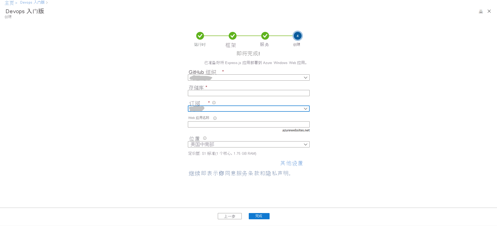
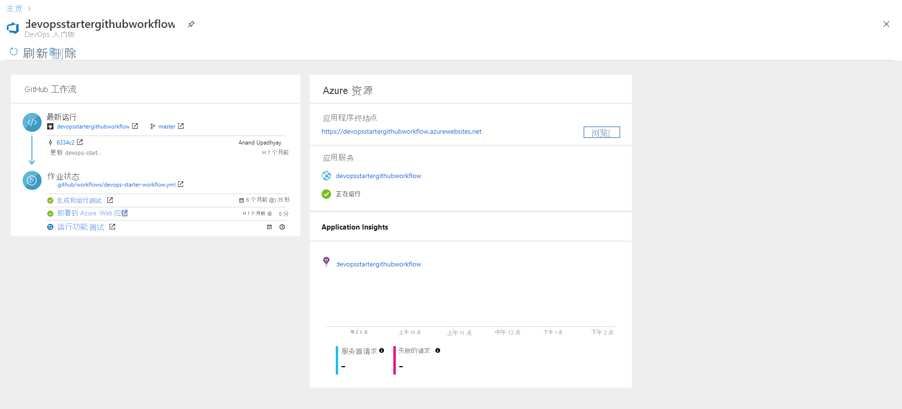

# 教程：使用适用于 GitHub Actions 的 DevOps Starter 将 Node.js 应用部署到 Azure Web 应用

适用于 GitHub Actions 的 DevOps Starter 提供一种简化的体验，即你可以选择一个示例应用程序来创建要部署到 Azure 的持续集成 (CI) 和持续交付 (CD) 工作流。 

DevOps Starter 还可以：
* 自动创建 Azure 资源，例如新的 Azure Web 应用。
* 在 GitHub 中创建和配置包含 CI 生成作业的工作流。
* 该工作流还包含 CD 部署作业。 
* 创建用于监视的 Azure Application Insights 资源。

在本教程中，将：

> [!div class="checklist"]
> * 使用 DevOps Starter 部署 Node.js 应用
> * 配置 GitHub 和 Azure 订阅 
> * 检查 GitHub 工作流
> * 提交对 GitHub 所做的更改并将其自动部署到 Azure
> * 配置 Azure Application Insights 监视
> * 清理资源

## 先决条件

* 具有活动订阅的 Azure 帐户。 [免费创建帐户](https://azure.microsoft.com/free/)。

## 使用 DevOps Starter 部署 Node.js 应用

DevOps Starter 会在 GitHub 中创建工作流。 你可以使用现有 GitHub 组织。 DevOps Starter 还可在所选的 Azure 订阅中创建 Azure 资源，例如 Web 应用。

1. 登录 [Azure 门户](https://portal.azure.com)。

1. 在搜索框中键入“DevOps 入门版”，然后选择。 单击“添加”以新建一个。

    

1. 确保选择 CI/CD 提供程序作为 GitHub Actions。

    

1. 依次选择“Node.js”、“下一步” 。

1. 在“选择应用程序框架”下选择“Express.js”，然后选择“下一步”  。 在前述步骤中选择的应用程序框架规定了此处可用的 Azure 服务部署目标的类型。 

1. 选择 Windows Web 应用，然后选择“下一步” 。

## 配置 GitHub 和 Azure 订阅

1. 向 GitHub 授权并选择一个现有的 GitHub 组织。 

1. 输入 GitHub 存储库的名称。 

1. 选择你的 Azure 订阅服务。 （可选）可以选择“更改”，然后输入其他配置详细信息，例如 Azure 资源的位置。
 
1. 输入 Web 应用名称，然后选择“完成”。 几分钟后，该 Azure Web 应用即可准备就绪。 将在你的 GitHub 组织的存储库中设置一个示例 Node.js 应用程序，触发工作流，然后将应用程序部署到新创建的 Azure Web 应用。

       

   完成上述过程后，DevOps Starter 仪表板会显示在 Azure 门户中。 也可以从 Azure 门户中的“所有资源”直接导航到仪表板。 

   在此仪表板中可以查看 GitHub 代码存储库、CI/CD 工作流，以及 Azure 中正在运行的应用程序。   

   

DevOps Starter 会自动配置用于将代码更改部署到存储库的触发器。
    
## 检查 GitHub 工作流

在上一步中，DevOps Starter 自动配置了一个完整的 GitHub 工作流。 根据需要浏览和自定义工作流。 执行以下步骤以熟悉工作流。

1. 在 DevOps Starter 仪表板的左侧，选择“GitHub 工作流”。 此链接会打开一个浏览器标签页以及新项目的 GitHub 工作流。
    > [!NOTE]
    > 请勿重命名工作流文件。 工作流文件的名称应为 devops-starter-workflow.yml，以便仪表板反映所做的更改

1. 工作流 yaml 文件包含生成和部署应用程序所需的所有 GitHub Actions。 单击“编辑文件”选项以自定义工作流文件。

1. 在存储库的“代码”选项卡下，单击“提交” 。 此视图显示与特定部署相关联的代码提交。

1. 在存储库的“操作”选项卡下，可以查看存储库的所有工作流运行的历史记录。

1. 选择“最新运行”可查看工作流中运行的所有作业。

1. 单击“作业”可查看工作流运行的详细日志。 日志包含有关部署过程的有用信息。 日志可以在部署过程中以及部署以后查看。

1. 单击“拉取请求”选项卡可查看存储库中的所有拉取请求

## 提交代码更改并执行 CI/CD

DevOps Starter 会在 GitHub 中创建存储库。 若要查看存储库并对应用程序进行代码更改，请执行以下操作：

1. 在 DevOps Starter 仪表板的左侧，选择 master 分库的链接。 此链接会打开新建 GitHub 存储库的视图。

1. 若要查看存储库克隆 URL，请在浏览器右上角选择“克隆”。 可以在最常用的 IDE 中克隆 Git 存储库。 在后续几个步骤中，可以使用 Web 浏览器直接对 master 分库进行代码更改并提交所做的更改。

1. 在浏览器左侧，转到 /Application/views/index.pug 文件。

1. 选择“编辑”，然后对某些文本进行更改。
    例如，更改某个标记的某些文本。

1. 选择“提交”并保存更改。

1. 在浏览器中，转到 DevOps 入门版仪表板。   
现在，你应该会看到一个正在进行的 GitHub 工作流生成作业。 刚做的更改会自动通过 GitHub 流水线进行生成和部署。

1. 部署完成后，刷新应用程序以验证更改。

## 配置 Azure Application Insights 监视

可以使用 Azure Application Insights 轻松监视应用程序的性能和使用情况。 DevOps Starter 会自动为应用程序配置 Application Insights 资源。 你可以根据需要进一步配置各种警报和监视功能。

1. 在 Azure 门户中，转到 DevOps Starter 仪表板。 

1. 在右下角，选择应用对应的“Application Insights”链接。 此时会打开“Application Insights”窗格。 此视图包含应用的使用情况、性能和可用性监视信息。

    

1. 选择“时间范围”，然后选择“过去一小时”。  若要筛选结果，请选择“更新”。 现在可以查看过去 60 分钟的所有活动。 
    
1. 若要退出时间范围，请选择“x”。

1. 选择“警报”，然后选择“添加指标警报”。  

1. 输入警报的名称。

1. 在“指标”下拉列表中，检查各种警报指标。 默认警报针对 **服务器响应时间大于 1 秒** 的情况。 可以轻松地配置各种警报，以便改进应用的监视功能。

1. 选中“通过电子邮件通知所有者、参与者和读者”复选框。 （可选）可以在显示警报时，通过执行 Azure 逻辑应用来执行其他操作。

1. 选择“确定”以创建警报。 片刻之后，警报就会在仪表板上显示为活动状态。 

1. 退出“警报”区域，返回到“Application Insights”窗格。 

1. 选择“可用性”，然后选择“添加测试”。  

1. 输入测试名称，然后选择“创建”。 此时会创建简单的 ping 测试来验证应用程序的可用性。 数分钟后，测试结果可用，此时 Application Insights 仪表板会显示可用性状态。

## 清理资源

测试后，可以清理资源，以避免产生费用。 不再需要本教程中创建的 Azure 虚拟机和相关资源时，可将其删除。 为此，请使用 DevOps Starter 仪表板上的“删除”功能。 

> [!IMPORTANT]
> 以下过程会永久删除资源。 “删除”功能会销毁 DevOps Starter 中的项目同时在 Azure 中创建的数据，删除后便无法检索这些数据。 只能在仔细阅读提示后才使用此过程。

1. 在 Azure 门户中，转到 DevOps Starter 仪表板。
1. 在右上角选择“删除”。 
1. 出现提示时，请选择“是”以永久删除这些资源。

你可以选择根据所在团队的需求修改工作流。 也可以将此 CI/CD 模式用作其他存储库的模板。 

## 后续步骤

在本教程中，你了解了如何执行以下操作：

> [!div class="checklist"]
> * 使用 DevOps Starter 部署 Node.js 应用
> * 配置 GitHub 和 Azure 订阅 
> * 检查 GitHub 工作流
> * 提交对 GitHub 所做的更改并将其自动部署到 Azure
> * 配置 Azure Application Insights 监视
> * 清理资源

若要详细了解 GitHub Actions 和工作流，请参阅：

> [!div class="nextstepaction"]
> [自定义 GitHub 工作流](https://docs.github.com/actions/configuring-and-managing-workflows/configuring-and-managing-workflow-files-and-runs)
