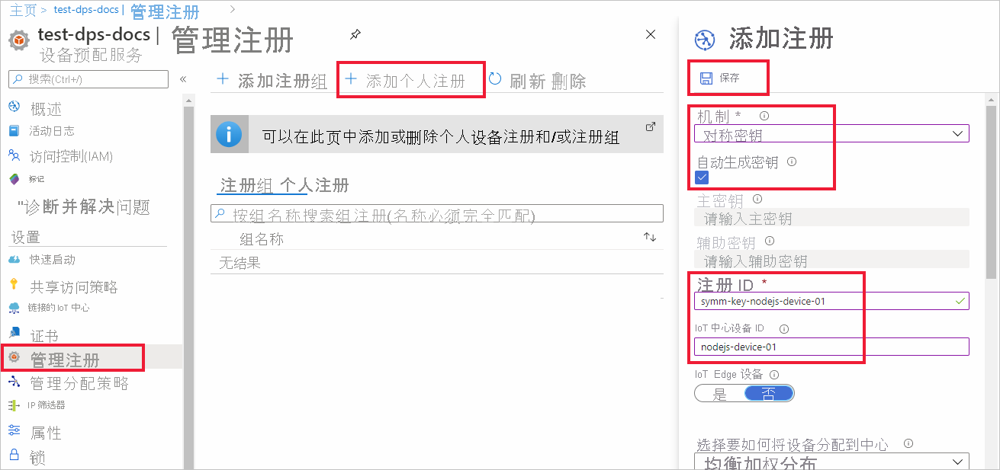
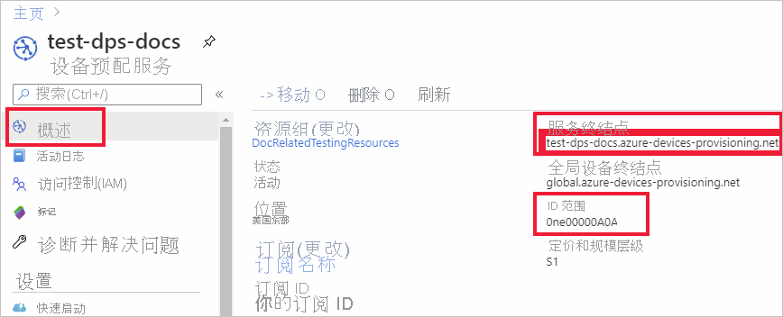
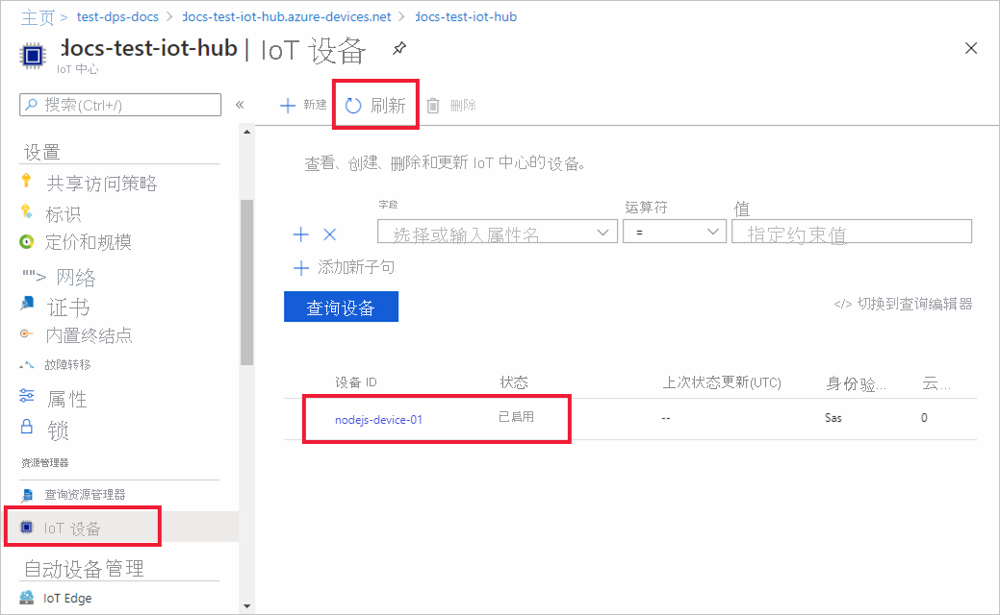

# <a name="quickstart-provision-a-symmetric-key-device-using-nodejs"></a>快速入门：使用 Node.js 预配对称密钥设备

本快速入门将介绍如何使用 Node.js 将 Windows 开发计算机作为设备预配到 IoT 中心。 此设备将使用对称密钥和单个注册对设备预配服务 (DPS) 实例进行身份验证，以便被分配到 IoT 中心。 [适用于 Node.js 的 Azure IoT SDK](https://github.com/Azure/azure-iot-sdk-node.git) 中的示例代码将用于预配设备。 

虽然本文演示了使用单个注册进行预配，但你也可以使用注册组。 使用注册组时有一些不同之处。 例如，必须将派生的设备密钥与设备的唯一注册 ID 一起使用。 [使用对称密钥预配设备](how-to-legacy-device-symm-key.md)提供了注册组示例。 有关注册组的详细信息，请参阅[对称密钥证明的组注册](concepts-symmetric-key-attestation.md#group-enrollments)。

如果不熟悉自动预配过程，请查看[预配](about-iot-dps.md#provisioning-process)概述。 

另外，在继续学习本快速入门之前，请确保已完成[通过 Azure 门户设置 IoT 中心设备预配服务](./quick-setup-auto-provision.md)中的步骤。 本快速入门需要你已创建设备预配服务实例。

本文面向基于 Windows 的工作站。 但是，你也可以在 Linux 上执行过程。 对于 Linux 示例，请参阅[多租户预配](how-to-provision-multitenant.md)。


[!INCLUDE [quickstarts-free-trial-note](../../includes/quickstarts-free-trial-note.md)]


## <a name="prerequisites"></a>先决条件

- 熟悉[预配](about-iot-dps.md#provisioning-process)概念。
- 完成[通过 Azure 门户设置 IoT 中心设备预配服务](./quick-setup-auto-provision.md)。
- 具有活动订阅的 Azure 帐户。 [免费创建一个](https://azure.microsoft.com/free/?ref=microsoft.com&utm_source=microsoft.com&utm_medium=docs&utm_campaign=visualstudio)。
- [Node.js v4.0+](https://nodejs.org)。
- [Git](https://git-scm.com/download/)。


## <a name="create-a-device-enrollment"></a>创建设备注册

1. 登录到 [Azure 门户](https://portal.azure.com)，选择左侧菜单上的“所有资源”按钮，打开设备预配服务 (DPS) 实例。

2. 选择“管理注册”选项卡，然后选择顶部的“添加个人注册”按钮 。 

3. 在“添加注册”面板中输入以下信息，然后按“保存”按钮   。

   - **机制** ：选择“对称密钥”作为标识证明“机制”   。

   - **自动生成密钥** ：选中此框。

   - **注册 ID** ：输入注册 ID 以标识注册。 仅使用小写字母数字和短划线（“-”）字符。 例如 symm-key-nodejs-device-01。

   - **IoT 中心设备 ID：** 输入设备标识符。 例如 nodejs-device-01。

     

4. 保存注册后，将生成“主要密钥”和“辅助密钥”，并将其添加到注册条目   。 对称密钥设备注册会在“单个注册”选项卡的“注册 ID”列下显示为“symm-key-nodejs-device-01” 。 

5. 打开注册并复制生成的“主要密钥”的值。 稍后你将在添加用于设备预配示例代码的环境变量时使用此密钥值和“注册 ID”。


## <a name="prepare-the-nodejs-environment"></a>准备 Node.js 环境 

1. 打开 Git CMD 或 Git Bash 命令行环境。 使用以下命令克隆[适用于 Node.js 的 Azure IoT SDK](https://github.com/Azure/azure-iot-sdk-node.git) GitHub 存储库：

    ```cmd
    git clone https://github.com/Azure/azure-iot-sdk-node.git --recursive
    ```


<a id="firstbootsequence"></a>

## <a name="prepare-the-device-provisioning-code"></a>准备设备预配代码

本部分将添加以下四个环境变量，这些变量将作为参数用于设备预配示例代码，以预配对称密钥设备。 

* `PROVISIONING_HOST`
* `PROVISIONING_IDSCOPE`
* `PROVISIONING_REGISTRATION_ID`
* `PROVISIONING_SYMMETRIC_KEY`

预配代码将根据这些变量联系 DPS 实例，以便对设备进行身份验证。 然后，会根据单个注册配置将设备分配到已链接到 DPS 实例的 IoT 中心。 预配后，示例代码会将一些测试遥测发送到 IoT 中心。

1. 在 [Azure 门户](https://portal.azure.com)中的“设备预配服务”菜单上，选择“概述”，并复制“服务终结点”和“ID 范围” 。 你会将这些值用于 `PROVISIONING_HOST` 和 `PROVISIONING_IDSCOPE` 环境变量。

    

2. 打开用于执行 Node.js 命令的命令提示符，然后导航到以下 provisioning/device/samples 目录。

    ```cmd
    cd azure-iot-sdk-node/provisioning/device/samples
    ```

3. 在“provisioning/device/samples”文件夹中打开“register_symkey.js”并查看代码 。 

    请注意，示例代码将设置自定义有效负载…

    ```nodejs
    provisioningClient.setProvisioningPayload({a: 'b'});
    ```

    本快速入门不需要此代码。 如果要使用自定义分配函数将设备分配到 IoT 中心，可参考此代码示例设置自定义有效负载。 有关详细信息，请参阅[教程：使用自定义分配策略](tutorial-custom-allocation-policies.md)。

    使用 `provisioningClient.register()` 方法尝试注册设备。

    无需对示例代码进行任何更改即可注册设备。

4. 在命令提示符中，为上一部分从单个注册中复制的预配主机、ID 范围、注册 ID 和主对称密钥添加环境变量。  

    以下命令是展示命令语法的示例。 确保使用正确的值。

    ```console
    set PROVISIONING_HOST=test-dps-docs.azure-devices-provisioning.net
    ```

    ```console
    set PROVISIONING_IDSCOPE=0ne00000A0A
    ```

    ```console
    set PROVISIONING_REGISTRATION_ID=symm-key-nodejs-device-01
    ```

    ```console
    set PROVISIONING_SYMMETRIC_KEY=sbDDeEzRuEuGKag+kQKV+T1QGakRtHpsERLP0yPjwR93TrpEgEh/Y07CXstfha6dhIPWvdD1nRxK5T0KGKA+nQ==
    ```


4. 使用以下命令生成和运行示例代码。

    ```console
    npm install
    ```

    ```console
    node register_symkey.js
    ```

5. 预期输出应与以下内容类似，其中显示根据单个注册设置设备被分配到的已链接的 IoT 中心。 “Hello World”字符串将作为测试消息发送到此中心：

    ```output
    D:\Docs\test\azure-iot-sdk-node\provisioning\device\samples>node register_symkey.js
    registration succeeded
    assigned hub=docs-test-iot-hub.azure-devices.net
    deviceId=nodejs-device-01
    payload=undefined
    Client connected
    send status: MessageEnqueued    
    ```
    
6. 在 Azure 门户中，导航到已链接到预配服务的 IoT 中心，并打开“IoT 设备”边栏选项卡。 成功将对称密钥设备预配到中心后，设备 ID 的“状态”会显示为“已启用”。 如果在运行设备示例代码前已打开边栏选项卡，则可能需要按顶部的“刷新”按钮。 

     

> [!NOTE]
> 如果从设备的注册项中的默认值更改了“初始设备孪生状态”  ，则它会从中心拉取所需的孪生状态，并执行相应的操作。 有关详细信息，请参阅[了解并在 IoT 中心内使用设备孪生](../iot-hub/iot-hub-devguide-device-twins.md)。
>


## <a name="clean-up-resources"></a>清理资源

如果打算继续使用和探索设备客户端示例，请勿清理在本快速入门中创建的资源。 如果不打算继续学习，请按以下步骤删除本快速入门中创建的所有资源。

1. 在 Azure 门户的左侧菜单中选择“所有资源”，然后选择设备预配服务。 打开服务的“管理注册”，然后选择“个人注册”选项卡   。选中在本快速入门中注册的设备的“注册 ID”旁边的复选框，然后按窗格顶部的“删除”按钮   。 
1. 在 Azure 门户的左侧菜单中选择“所有资源”，然后选择 IoT 中心  。 打开中心的“IoT 设备”，选中在本快速入门中注册的设备的“设备 ID”旁边的复选框，然后按窗格顶部的“删除”按钮    。

## <a name="next-steps"></a>后续步骤

在此快速入门中，你使用 IoT 中心设备预配服务将基于 Windows 的对称密钥设备预配到了 IoT 中心。 若要了解如何使用 Node.js 预配 X.509 证书设备，请继续阅读下面的 X.509 设备快速入门。 

> [!div class="nextstepaction"]
> [Azure 快速入门 - 使用 DPS 和 Node.js 预配 X.509 设备](quick-create-simulated-device-x509-node.md)
