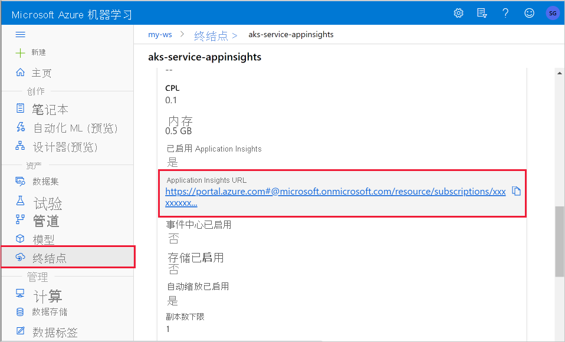

# <a name="monitor-and-collect-data-from-ml-web-service-endpoints"></a>监视机器学习 Web 服务终结点以及从中收集数据


在本文中，你将了解如何从部署到 Azure Kubernetes 服务 (AKS) 或 Azure 容器实例 (ACI) 中 Web 服务终结点的模型收集数据。 使用 [Azure Application Insights](../azure-monitor/app/app-insights-overview.md) 从终结点收集以下数据：
* 输出数据
* 响应
* 请求速率、响应时间和失败率
* 依赖项速率、响应时间和失败率
* 异常

[enable-app-insights-in-production-service.ipynb](https://github.com/Azure/MachineLearningNotebooks/blob/master/how-to-use-azureml/deployment/enable-app-insights-in-production-service/enable-app-insights-in-production-service.ipynb) 笔记本演示了本文所述的概念。
 
[!INCLUDE [aml-clone-in-azure-notebook](../../includes/aml-clone-for-examples.md)]
 
## <a name="prerequisites"></a>先决条件

* Azure 订阅-试用 [Azure 机器学习免费版或付费版](https://aka.ms/AMLFree)。

* 已安装 Azure 机器学习工作区、一个包含脚本的本地目录以及用于 Python 的 Azure 机器学习 SDK。 若要了解详细信息，请参阅[如何配置开发环境](how-to-configure-environment.md)。

* 已定型的机器学习模型。 若要了解详细信息，请参阅[训练图像分类模型](tutorial-train-models-with-aml.md)教程。

<a name="python"></a>

## <a name="configure-logging-with-the-python-sdk"></a>使用 Python SDK 配置日志记录

本部分介绍如何使用 Python SDK 启用 Application Insights 日志记录。 

### <a name="update-a-deployed-service"></a>更新已部署的服务

使用以下步骤更新现有的 Web 服务：

1. 在工作区中标识该服务。 `ws` 的值是工作区的名称

    ```python
    from azureml.core.webservice import Webservice
    aks_service= Webservice(ws, "my-service-name")
    ```
2. 更新服务并启用 Azure Application Insights

    ```python
    aks_service.update(enable_app_insights=True)
    ```

### <a name="log-custom-traces-in-your-service"></a>在服务中记录自定义跟踪

> [!IMPORTANT]
> Azure Application Insights 仅记录最多 64kb 的有效负载。 如果达到此限制，则可能会出现诸如内存不足或不会记录任何信息之类的错误。 如果要记录的数据大于 64kb，应使用[为生产环境中的模型收集数据](how-to-enable-data-collection.md)中的信息，将其存储到 Blob 存储中。
>
> 对于更复杂的情况（如 AKS 部署中的模型跟踪），我们建议使用第三方库，如 [OpenCensus](https://opencensus.io)。

若要记录自定义跟踪，请遵循[部署方式和部署位置](how-to-deploy-and-where.md)文档中适用于 AKS 或 ACI 的标准部署过程。 然后，使用以下步骤：

1. 通过添加 print 语句来更新计分文件，以在推理期间将数据发送到 Application Insights。 对于更复杂的信息（例如请求数据和响应），请使用 JSON 结构。 

    下面的示例 `score.py` 文件记录模型初始化的时间、推理期间的输入和输出以及发生任何错误的时间。

    
    ```python
    import pickle
    import json
    import numpy 
    from sklearn.externals import joblib
    from sklearn.linear_model import Ridge
    from azureml.core.model import Model
    import time

    def init():
        global model
        #Print statement for appinsights custom traces:
        print ("model initialized" + time.strftime("%H:%M:%S"))
        
        # note here "sklearn_regression_model.pkl" is the name of the model registered under the workspace
        # this call should return the path to the model.pkl file on the local disk.
        model_path = Model.get_model_path(model_name = 'sklearn_regression_model.pkl')
        
        # deserialize the model file back into a sklearn model
        model = joblib.load(model_path)
    

    # note you can pass in multiple rows for scoring
    def run(raw_data):
        try:
            data = json.loads(raw_data)['data']
            data = numpy.array(data)
            result = model.predict(data)
            # Log the input and output data to appinsights:
            info = {
                "input": raw_data,
                "output": result.tolist()
                }
            print(json.dumps(info))
            # you can return any datatype as long as it is JSON-serializable
            return result.tolist()
        except Exception as e:
            error = str(e)
            print (error + time.strftime("%H:%M:%S"))
            return error
    ```

2. 更新服务配置，并确保启用 Application Insights。
    
    ```python
    config = Webservice.deploy_configuration(enable_app_insights=True)
    ```

3. 生成一个映像并将它部署到 AKS 或 ACI 上。 有关详细信息，请参阅[部署方式及位置](how-to-deploy-and-where.md)。


### <a name="disable-tracking-in-python"></a>在 Python 中禁用跟踪

若要禁用 Azure Application Insights，请使用以下代码：

```python 
## replace <service_name> with the name of the web service
<service_name>.update(enable_app_insights=False)
```

<a name="studio"></a>

## <a name="configure-logging-with-azure-machine-learning-studio"></a>使用 Azure 机器学习工作室配置日志记录

还可以从 Azure 机器学习工作室启用 Azure Application Insights。 当你准备好将模型部署为 Web 服务时，请使用以下步骤启用 Application Insights：

1. 登录到 studio https://ml.azure.com 。
1. 转到“模型”并选择要部署的模型。
1. 选择“+部署”。
1. 填充“部署模型”窗体。
1. 展开“高级”菜单。

    
1. 选择 " **启用 Application Insights 诊断和数据收集** "。

    

## <a name="view-metrics-and-logs"></a>查看指标和日志

### <a name="query-logs-for-deployed-models"></a>查询部署的模型的日志

可以使用 `get_logs()` 函数从以前部署的 Web 服务检索日志。 日志可以包含有关部署期间发生的任何错误的详细信息。

```python
from azureml.core.webservice import Webservice

# load existing web service
service = Webservice(name="service-name", workspace=ws)
logs = service.get_logs()
```

### <a name="view-logs-in-the-studio"></a>在工作室中查看日志

Azure Application Insights 将服务日志存储在与 Azure 机器学习工作区相同的资源组中。 按照以下步骤使用工作室查看数据：

1. 在 [工作室](https://ml.azure.com/)中转到 Azure 机器学习工作区。
1. 选择“终结点”。
1. 选择已部署的服务。
1. 选择“Application Insights url”链接。

    [](././media/how-to-enable-app-insights/appinsightsloc.png#lightbox)

1. 在 Application Insights 中，从“概述”选项卡或“监视”部分选择“日志” 。

    [](./media/how-to-enable-app-insights/overview.png#lightbox)

1. 若要查看从 score.py 文件记录的信息，请查看跟踪表。 以下查询搜索记录了输入值的日志：

    ```kusto
    traces
    | where customDimensions contains "input"
    | limit 10
    ```

   [](././media/how-to-enable-app-insights/model-data-trace.png#lightbox)

有关如何使用 Azure Application Insights 的详细信息，请参阅[什么是 Application Insights](../azure-monitor/app/app-insights-overview.md)。

## <a name="web-service-metadata-and-response-data"></a>Web 服务元数据和响应数据

> [!IMPORTANT]
> Azure Application Insights 仅记录最多 64kb 的有效负载。 如果达到此限制，可能会出现内存不足或未记录任何信息等错误。

若要记录 Web 服务请求信息，请将 `print` 语句添加到 score.py 文件。 每个 `print` 语句都会在 Application Insights 跟踪表中的消息 `STDOUT` 下生成一个条目。 Application Insights 将 `print` 语句输出存储在 `customDimensions` 和 `Contents` 跟踪表中。 打印 JSON 字符串会在 `Contents` 下的跟踪输出中生成分层数据结构。

## <a name="export-data-for-retention-and-processing"></a>导出数据以进行保留和处理

>[!Important]
> Azure Application Insights 仅支持导出到 Blob 存储。 有关此实现限制的详细信息，请参阅[从 App Insights 导出遥测](../azure-monitor/app/export-telemetry.md#continuous-export-advanced-storage-configuration)。

使用 Application Insights 的[连续导出](../azure-monitor/app/export-telemetry.md)将数据导出到 Blob 存储帐户，你可以在其中定义保留设置。 Application Insights 以 JSON 格式导出数据。 

:::image type="content" source="media/how-to-enable-app-insights/continuous-export-setup.png" alt-text="连续导出":::

## <a name="next-steps"></a>后续步骤

本文介绍了如何为 Web 服务终结点启用日志记录和查看日志。 有关后续步骤，请尝试阅读以下文章：


* [如何将模型部署到 AKS 群集](./how-to-deploy-azure-kubernetes-service.md)

* [如何将模型部署到 Azure 容器实例](./how-to-deploy-azure-container-instance.md)

* [MLOps：使用 Azure 机器学习管理、部署和监视模型](./concept-model-management-and-deployment.md)，详细了解在生产中利用从模型收集的数据。 此类数据有助于持续改进你的机器学习流程。