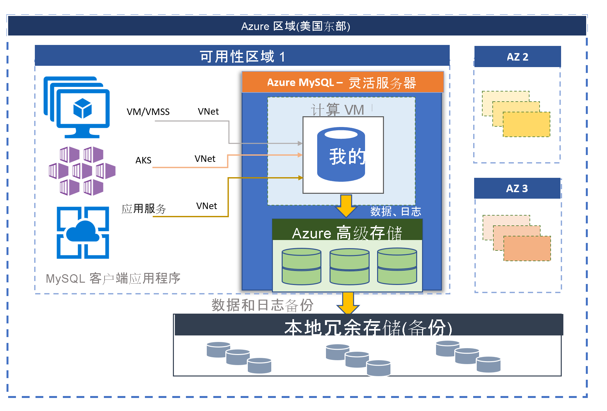

# Azure Database for MySQL 灵活服务器（预览版）

由 MySQL 社区版提供支持的 Azure Database for MySQL 提供两种部署模式：
- 单台服务器 
- 灵活服务器（预览版）

本文概述和介绍了灵活服务器部署模型的核心概念。 若要了解如何确定适合工作负荷的部署选项，请参阅[在 Azure 中选择合适的 MySQL 服务器选项](./../select-right-deployment-type.md)。

## 概述

Azure Database for MySQL 灵活服务器是一种完全托管的数据库服务，旨在针对数据库管理功能和配置设置提供更精细的控制和更大的灵活性。 通常，该服务提供更大的灵活性和基于用户要求的服务器配置自定义。 灵活服务器体系结构允许用户选择单个可用性区域内以及跨多个可用性区域的高可用性。 灵活服务器还提供了更好的成本优化控制，具有停止/启动服务器和可突增 SKU 的功能，非常适合无需持续全计算容量的工作负载。 该服务当前支持 MySQL 5.7 的社区版本。 此服务目前处于预览状态，现已在各种 [Azure 区域](https://azure.microsoft.com/global-infrastructure/services/)中提供。

灵活服务器最适合用于 
- 需要更好的控制和自定义的应用程序开发。
- 区域冗余高可用性
- 托管维护时段

 

## 可用性区域内和跨可用性区域的高可用性

灵活服务器部署模型旨在支持单个可用性区域内以及跨多个可用性区域的高可用性。 该体系结构将计算和存储分开。 数据库引擎在虚拟机上运行，而数据文件位于 Azure 存储上。 该存储维护数据库文件的三个本地冗余同步副本，以确保数据始终具有持续性。 

在单个可用性区域中，如果服务器由于计划内或计划外事件而发生故障，该服务将使用以下自动化过程来维持服务器的高可用性：

1. 预配新的计算 VM。
2. 具有数据文件的存储映射到新的虚拟机
3. MySQL 数据库引擎在新的虚拟机上联机。
4. 服务器准备好接受连接后，客户端应用程序可以重新连接。
   
:::image type="content" source="media/overview/2-flexible-server-architecture.png" alt-text="单个区域高可用性概念图"::: 

如果已配置区域冗余高可用性，则该服务将在同一 Azure 区域内的可用性区域中预配并维护热备用服务器。 源服务器上的数据更改将同步复制到备用服务器，以确保没有数据丢失。 借助区域冗余高可用性，一旦触发了计划内或计划外的故障转移事件，备用服务器将立即联机，并可用于处理传入的事务。 典型的故障转移时间范围为 60 - 120 秒。 这使服务可以支持高可用性，并提供改进的复原能力，可容忍给定 Azure 区域中的单个可用性区域故障。 

有关详细信息，请参阅[高可用性概念](concepts-high-availability.md)。

:::image type="content" source="media/overview/3-flexible-server-overview-zone-redundant-ha.png" alt-text="区域冗余高可用性概念图"::: 

## 具有托管维护时段的自动修补

该服务执行基础硬件、OS 和数据库引擎的自动修补。 修补包括安全更新和软件更新。 对于 MySQL 引擎，次要版本升级也包括在计划内维护版本中。 用户可以将修补计划配置为系统托管或定义自己的自定义计划。 在维护计划期间，将应用补丁，并且在修补过程中，可能需要重启服务器才能完成更新。 使用自定义计划，用户可以使修补周期可预测，并选择对业务影响最小的维护时段。 一般来说，作为持续集成和发布的一部分，该服务遵循每月发布计划。

有关更多详细信息，请参阅[计划性维护](concepts-maintenance.md)。 

## 自动备份

灵活服务器服务可自动创建服务器备份并将其存储在用户本地配置的冗余或异地冗余存储中。 备份可用于将服务器还原到备份保持期内的任何时间点。 默认的备份保留期为七天。 保持期可选择配置为最多 35 天。 所有备份都使用 AES 256 位加密进行加密。 

有关详细信息，请参阅[备份概念](concepts-backup-restore.md)。

## 网络隔离

可以通过两个网络选项连接到 Azure Database for MySQL 灵活服务器。 这两个选项是“专用访问(VNet 集成)”和“公共访问(允许的 IP 地址)” 。 

* 专用访问(VNet 集成) - 可以将灵活服务器部署到 [Azure 虚拟网络](../../virtual-network/virtual-networks-overview.md)中。 Azure 虚拟网络提供专用的安全网络通信。 虚拟网络中的各个资源可通过专用 IP 地址进行通信。

   如果需要以下功能，请选择“VNet 集成”选项：
   * 使用专用 IP 地址从同一虚拟网络中的 Azure 资源连接到灵活服务器
   * 使用 VPN 或 ExpressRoute 从非 Azure 资源连接到灵活服务器
   * 无公共终结点

* 公共访问(允许的 IP 地址) - 可以通过公共终结点部署灵活服务器。 公共终结点是可公开解析的 DNS 地址。 “允许的 IP 地址”一词是指你选择向其授予访问服务器的权限的一系列 IP。 这些权限称为“防火墙规则”。

有关详细信息，请参阅[网络概念](concepts-networking.md)。

## 几秒钟内调整性能和规模

灵活服务器服务在三个 SKU 层中提供：“可突增”、“常规用途”和“内存优化”。 可突增层最适合用于低成本开发和不需要持续全计算容量的低并发工作负载。 常规用途和内存优化更适用于需要高并发性、缩放性和可预测性能的生产工作负载。 可以在一个月内花费很少的费用在小型数据库上生成第一个应用，然后无缝调整规模以满足解决方案的需求。 存储缩放是联机的，支持存储自动增长。 动态可伸缩性使得数据库能够以透明方式对不断变化的资源需求做出响应。 只需为所使用的资源付费。 

有关详细信息，请参阅[计算和存储概念](concepts-compute-storage.md)。

## 通过多达 10 个只读副本扩展读取工作负载

MySQL 是一种常用的数据库引擎，用于运行 Internet 规模的 Web 和移动应用程序。 许多客户将其用于在线教育服务、视频流式处理服务、数字支付解决方案、电子商务平台、游戏服务、新闻门户、政府和医疗保健网站。 这些服务需要随着 Web 或移动应用程序流量的增加而服务和扩展。

在应用程序端，应用程序通常是用 Java 或 php 开发的，并迁移到  [Azure 虚拟机规模集](../../virtual-machine-scale-sets/overview.md) 或  [Azure 应用服务](../../app-service/overview.md) 上运行，或容器化以在  [Azure Kubernetes 服务 (AKS)](../../aks/intro-kubernetes.md) 上运行。 使用虚拟机规模集、应用服务或 AKS 作为底层基础结构，可以通过即时预配新的 VM 并复制应用程序的无状态组件来满足请求，以简化应用程序的缩放，但是数据库通常会成为集中式有状态组件的瓶颈。

使用只读副本功能可将数据从 Azure Database for MySQL 灵活服务器复制到只读服务器。 可将源服务器中的数据复制到最多 10 个副本。 使用 MySQL 引擎的[基于二进制日志 (binlog) 文件位置的原生复制技术](https://dev.mysql.com/doc/refman/5.7/en/replication-features.html)以异步方式更新副本。 可以使用负载均衡器代理解决方案（如 [ProxySQL](https://techcommunity.microsoft.com/t5/azure-database-for-mysql/load-balance-read-replicas-using-proxysql-in-azure-database-for/ba-p/880042)）将应用程序工作负载无缝扩展到只读副本，而无需任何应用程序重构成本。 

有关详细信息，请参阅[只读副本概念](concepts-read-replicas.md)。 

## 停止/启动服务器以优化成本

灵活服务器服务允许你根据需要停止和启动服务器以优化成本。 服务器停止后，计算层计费会立即停止。 这使你可在开发和测试期间以及针对有时限的可预测生产工作负载，节省大量成本。 服务器将保持停止状态七天（除非提前重启它）。 

若要了解详细信息，请参阅[服务器概念](concept-servers.md)。 

## 企业级安全和隐私

灵活服务器服务使用 FIPS 140-2 验证的加密模块对静态数据进行存储加密。 在运行查询时创建的数据（包括备份）和临时文件都会进行加密。 该服务使用包含在 Azure 存储加密中的 AES 256 位密码，并且密钥可由系统进行管理（默认）。 

该服务使用默认实施的传输层安全性对动态数据进行加密。 灵活服务器仅支持使用传输层安全性 (TLS 1.2) 的加密连接，并且所有使用 TLS 1.0 和 TLS 1.1 的传入连接都将被拒绝。 

有关详细信息，请参阅[如何使用与灵活服务器的加密连接](https://docs.mongodb.com/manual/tutorial/configure-ssl)。

灵活服务器允许使用 [Azure 虚拟网络](../../virtual-network/virtual-networks-overview.md) (VNet) 集成对服务器进行完全专用访问。 只能通过专用 IP 地址才能访问和连接 Azure 虚拟网络中的服务器。 使用 VNet 集成，公共访问遭到拒绝，使用公共终结点无法访问服务器。 

有关详细信息，请参阅[网络概念](concepts-networking.md)。

## 监视和警报

灵活服务器服务配备了内置的性能监视和警报功能。 所有 Azure 指标的频率都是一分钟，每个指标提供 30 天的历史记录。 可针对指标配置警报。 该服务公开主机服务器指标来监视资源利用率，并允许配置慢查询日志。 使用这些工具，可快速优化工作负载并配置服务器以获得最佳性能。 

有关详细信息，请参阅[监视概念](concepts-monitoring.md)。

## 迁移

该服务运行 MySQL 的社区版本。 这样可以实现完全的应用程序兼容性，并且只需最小的重构成本就能将在 MySQL 引擎上开发的现有应用程序迁移到单一服务器服务。 可以使用以下任一选项来执行向单一服务器的迁移：

- 转储和还原 - 对于脱机迁移（在此情况下，用户可承受一定的故障时间），使用社区工具（如 mysqldump/mydumper）的转储和还原可以提供最快的迁移方式。 有关详细信息，请参阅“使用转储和还原进行迁移”。 
- Azure 数据库迁移服务 - 为了在最短的故障时间内实现向单一服务器的无缝简化迁移，可以利用 [Azure 数据库迁移服务](../../dms/tutorial-mysql-azure-mysql-online.md)。 

## Azure 区域

在 Azure 中运行工作负载的一个优点是，它可覆盖全球范围。 现在，在以下 Azure 区域提供适用于 Azure Database for MySQL 的灵活服务器：

- 西欧
- 北欧
- 英国南部
- 美国东部 2
- 美国西部 2
- 美国中部
- 美国东部
- 加拿大中部
- 东南亚
- 韩国中部
- 日本东部
- 澳大利亚东部

即将添加新的服务器。

## 联系人
如果有任何关于使用 Azure Database for MySQL 灵活服务器的问题或建议，请发送电子邮件至 Azure Database for MySQL 团队 ([@Ask Azure DB for MySQL](mailto:AskAzureDBforMySQL@service.microsoft.com))。 此电子邮件地址不是技术支持别名。

另外，请酌情考虑以下联系点：

- 若要联系 Azure 支持，请[从 Azure 门户提交票证](https://portal.azure.com/?#blade/Microsoft_Azure_Support/HelpAndSupportBlade)。
- 若要修复帐户问题，请在 Azure 门户中提交[支持请求](https://ms.portal.azure.com/#blade/Microsoft_Azure_Support/HelpAndSupportBlade/newsupportrequest)。
- 若要提供反馈或请求新功能，请通过 [UserVoice](https://feedback.azure.com/forums/597982-azure-database-for-mysql) 创建条目。

## 后续步骤
现在，你已阅读 Azure Database for MySQL 单一服务器部署模式简介，接下来可以：

- 创建你的第一个服务器。 
  - [使用 Azure 门户创建 Azure Database for MySQL 灵活服务器](quickstart-create-server-portal.md)
  - [使用 Azure CLI 创建 Azure Database for MySQL 灵活服务器](quickstart-create-server-cli.md)
  - [使用 Azure CLI 管理 Azure Database for MySQL 灵活服务器](how-to-manage-server-portal.md)

- 使用首选语言生成首个应用：
  - [Python](connect-python.md)
  - [Php](connect-php.md)
