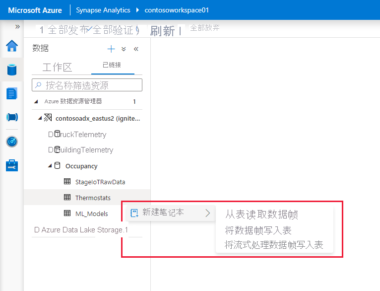

# 使用适用于 Azure Synapse Analytics 的 Apache Spark 连接到 Azure 数据资源管理器

本文介绍如何使用适用于 Azure Synapse Analytics 的 Apache Spark 从 Synapse Studio 访问 Azure 数据资源管理器数据库。

## 先决条件

* [创建 Azure 数据资源管理器群集和数据库](/azure/data-explorer/create-cluster-database-portal)。
* 具有现有的 Azure Synapse Analytics 工作区，或按照[快速入门：创建 Azure Synapse 工作区](./quickstart-create-workspace.md)中的步骤创建新的工作区。
* 具有现有的 Apache Spark 池，或按照[快速入门：使用 Azure 门户创建 Apache Spark 池](./quickstart-create-apache-spark-pool-portal.md)。
* [预配 Azure AD 应用程序以创建 Azure Active Directory (Azure AD) 应用](/azure/data-explorer/kusto/management/access-control/how-to-provision-aad-app)中的步骤创建一个新池。
* 按照[管理 Azure 数据资源管理器数据库权限](/azure/data-explorer/manage-database-permissions)中的步骤授予 Azure AD 应用访问数据库的权限。

## 转到 Synapse Studio

在 Azure Synapse 工作区中，选择“启动 Synapse Studio”。 在 Synapse Studio 主页上，选择“数据”，转到“数据对象资源管理器” 。

## 将 Azure 数据资源管理器数据库连接到 Azure Synapse 工作区

将 Azure 数据资源管理器数据库连接到工作区是通过链接服务完成的。 使用 Azure 数据资源管理器链接服务，可以浏览 Azure Synapse 的 Apache Spark 中的数据、读取和写入。 还可以在管道中运行集成作业。

从数据对象资源管理器中，按照以下步骤直接连接 Azure 数据资源管理器群集：

1. 选择“数据”旁边的“+”图标 。
1. 选择“连接”以连接到外部数据。
1. 选择“Azure 数据资源管理器 (Kusto)”。
1. 选择“继续”。
1. 使用易记名称命名链接服务。 该名称将显示在数据对象资源管理器中，并由 Azure Synapse 运行时用于连接到数据库。
1. 从订阅中选择 Azure 数据资源管理器群集或输入 URI。
1. 输入“服务主体 ID”和“服务主体密钥” 。 确保此服务主体对数据库具有查看访问权限并可访问引入器，以便读取和引入数据。
1. 输入 Azure 数据资源管理器数据库名称。
1. 选择“测试连接”以确保你具有正确的权限。
1. 选择“创建”。

    

    > [!NOTE]
    > （可选）“测试连接”不会验证写入访问权限。 请确保服务主体 ID 对 Azure 数据资源管理器数据库具有写入访问权限。

1. Azure 数据资源管理器群集和数据库显示在“Azure 数据资源管理器”部分下的“链接”选项卡上 。

    

    > [!NOTE]
    > 在当前版本中，将根据你在 Azure 数据资源管理器数据库上的 Azure AD 帐户权限填充数据库对象。 运行 Apache Spark 笔记本或集成作业时，将使用链接服务中的凭据（例如服务主体）。

## 与代码生成的操作快速交互

右键单击某个数据库或表时，会显示一个示例 Spark 笔记本列表。 选择一个选项来读取、写入数据或将数据流式传输到 Azure 数据资源管理器。

下面是读取数据的示例。 将笔记本附加到 Spark 池，并运行单元格。

   > [!NOTE]
   > 首次执行时，可能需要三分多钟才能启动 Spark 会话。 后续执行的速度要快得多。

## 限制

Azure Synapse 托管的虚拟网络目前不支持 Azure 数据资源管理器连接器。

## 后续步骤

* [具有高级选项的示例代码](https://github.com/Azure/azure-kusto-spark/blob/master/samples/src/main/python/SynapseSample.py)
* [Azure 数据资源管理器 (Kusto) Spark 连接器](https://github.com/Azure/azure-kusto-spark)