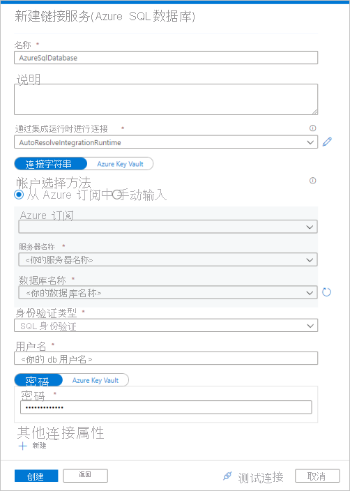
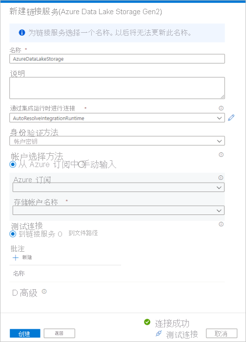
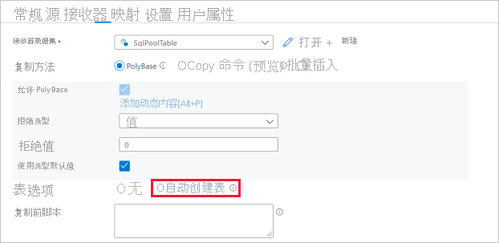
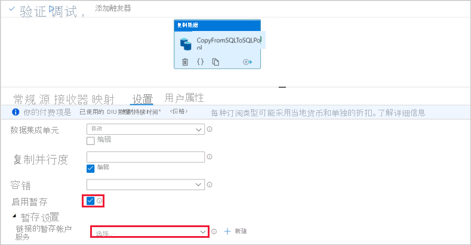

# 快速入门：使用复制活动将数据加载到 SQL 池中

Azure Synapse Analytics 提供了各种分析引擎，可帮助你引入、转换和分析数据，以及对数据建模。 SQL 池提供基于 T-SQL 的计算和存储功能。 在 Synapse 工作区中创建 SQL 池后，可以加载、处理和提供数据以及为数据建模，更快地获取分析见解。

本快速入门介绍如何将数据从 Azure SQL 数据库加载到 Azure Synapse Analytics。 可以遵循类似步骤，从其他类型的数据存储中复制数据。 类似的流程也适用于其他源和接收器之间的数据复制。

## 先决条件

* Azure 订阅：如果没有 Azure 订阅，请在开始之前创建一个[免费帐户](https://azure.microsoft.com/free/)。
* Azure Synapse 工作区：按照[快速入门：创建 Synapse 工作区](quickstart-create-workspace.md)中的说明，使用 Azure 门户创建 Synapse 工作区。
* Azure SQL 数据库：本教程从 Azure SQL 数据库中的 Adventure Works LT 示例数据集中复制数据。 可以按照[在 Azure SQL 数据库中创建示例数据库](../azure-sql/database/single-database-create-quickstart.md)中的说明在 SQL 数据库中创建此示例数据库。 也可以按类似步骤使用其他数据存储。
* Azure 存储帐户：Azure 存储用作复制操作中的暂存区域。 如果没有 Azure 存储帐户，请参阅[创建存储帐户](../storage/common/storage-account-create.md)中的说明。
* Azure Synapse Analytics：使用 SQL 池作为接收器数据存储。 如果你没有 Azure Synapse Analytics 实例，请参阅[创建 SQL 池](quickstart-create-sql-pool-portal.md)，了解创建该实例的步骤。

### 导航到 Synapse Studio

创建 Azure Synapse 工作区后，可以通过两种方式打开 Synapse Studio：

* 在 [Azure 门户](https://ms.portal.azure.com/#home)中打开 Synapse 工作区。 在“概述”部分的顶部，选择“启动 Synapse Studio”。
* 打开 [Azure Synapse Analytics](https://web.azuresynapse.net/) 并登录到工作区。

在本快速入门中，我们将使用名为“adftest2020”的工作区作为示例。 它将自动导航到 Synapse Studio 主页。

## 创建链接服务

在 Azure Synapse Analytics 中，链接服务是定义到其他服务的连接信息的一个位置。 在本部分中，创建以下两种类型的链接服务：Azure SQL 数据库和 Azure Data Lake Storage Gen2 链接服务。

1. 在 Synapse Studio 主页上，在左侧导航栏中选择“管理”选项卡。
1. 在“外部连接”下，选择“链接服务”。
  
   

1. 若要添加链接服务，请选择“新建”。
1. 从库中选择“Azure SQL 数据库”，然后选择“继续” 。 可以在搜索框中键入“sql”以筛选连接器。

   

1. 在“新建链接服务”页上，从下拉列表中选择服务器名称和 DB 名称，指定用户名和密码。 单击“测试连接”以验证设置，然后选择“创建” 。

   

1. 重复步骤 3 - 4，但从库中选择“Azure Data Lake Storage Gen2”。 在“新建链接服务”页上，从下拉列表中选择你的存储帐户名称。 单击“测试连接”以验证设置，然后选择“创建” 。 

   
 
## 创建管道

管道包含用于执行一组活动的逻辑流。 在本部分中，创建一个包含复制活动的管道，该复制活动将数据从 Azure SQL 数据库引入到 SQL 池中。

1. 转到“集成”选项卡。选择管道标题旁边的加号图标，然后选择“管道”。

   

1. 在“活动”窗格中的“移动和转换”下，将“复制数据”拖到管道画布上 。
1. 选择复制活动并转到“源”选项卡。选择“新建”以创建新的源数据集。

   

1. 选择“Azure SQL 数据库”作为数据存储，然后选择“继续” 。
1. 在“设置属性”窗格中，选择你在前面的步骤中创建的 Azure SQL 数据库链接服务。 
1. 在“表名称”下，选择要在后续复制活动中使用的示例表。 在本快速入门中，我们将“SalesLT.Customer”表用作示例。 

   
1. 完成后，选择“确定”。
1. 选择复制活动并转到“接收器”选项卡。选择“新建”以创建新的接收器数据集。
1. 选择“SQL Analytics 池”作为数据存储，然后选择“继续” 。
1. 在“设置属性”窗格中，选择你在前面的步骤中创建的 SQL Analytics 池。 如果要写入现有表，请在“表名称”下拉列表中选择它。 否则，请选中“编辑”，并输入新的表名称。 完成后，选择“确定”。
1. 对于接收器数据集设置，在表选项字段中启用“自动创建表”。

   

1. 在“设置”页上，选择“启用暂存”对应的复选框 。 如果你的源数据与 PolyBase 不兼容，则此选项适用。 在“暂存设置”部分中，选择在之前步骤中创建的 Azure Data Lake Storage Gen2 链接服务作为暂存存储。 

    该存储用于在通过 PolyBase 将数据加载至 Azure Synapse Analytics 前暂存数据。 复制完成后，自动清除 Azure Data Lake Storage Gen2 中的临时数据。

   

1. 若要验证管道，请选择工具栏中的“验证”。 你可以在页面右侧看到管道验证输出的结果。 

## 调试和发布管道

完成管道配置后，在发布项目之前你可以执行调试运行，以验证是否所有事项都正确。

1. 若要调试管道，请在工具栏上选择“调试”。 可以在窗口底部的“输出”选项卡中看到管道运行的状态。 

   

1. 管道运行成功后，在顶部工具栏中选择“全部发布”。 此操作将你创建的实体（数据集和管道）发布到 Synapse Analytics 服务。
1. 等待“已成功发布”消息出现。 若要查看通知消息，请选择右上角的铃铛按钮。 

## 触发和监视管道

在本部分中，手动触发在上一步骤中发布的管道。 

1. 选择工具栏中的“添加触发器”，然后选择“立即触发”。   在“管道运行”页上，选择“确定”。   
1. 转到左侧边栏中的“监视器”选项卡。 此时会看到由手动触发器触发的管道运行。 
1. 管道运行成功完成后，选择“管道名称”列下的链接以查看活动运行详细信息或重新运行管道。 此示例中只有一个活动，因此列表中只看到一个条目。 
1. 有关复制操作的详细信息，请选择“活动名称”列下的“详细信息”链接（眼镜图标） 。 可以监视详细信息，例如，从源复制到接收器的数据量、吞吐量、执行步骤以及相应的持续时间和使用的配置。

   

1. 若要切换回到管道运行视图，请选择顶部的“所有管道运行”链接。 选择“刷新”可刷新列表。 
1. 验证数据是否已正确写入到 SQL 池中。

## 后续步骤

请转至下列文章，了解 Azure Synapse Analytics 支持：

> [!div class="nextstepaction"]
> [管道和活动](https://docs.microsoft.com/azure/data-factory/concepts-pipelines-activities?toc=/azure/synapse-analytics/toc.json&bc=/azure/synapse-analytics/breadcrumb/toc.json)
> [连接器概述](https://docs.microsoft.com/azure/data-factory/connector-overview?toc=/azure/synapse-analytics/toc.json&bc=/azure/synapse-analytics/breadcrumb/toc.json)
> [复制活动](https://docs.microsoft.com/azure/data-factory/copy-activity-overview?toc=/azure/synapse-analytics/toc.json&bc=/azure/synapse-analytics/breadcrumb/toc.json)