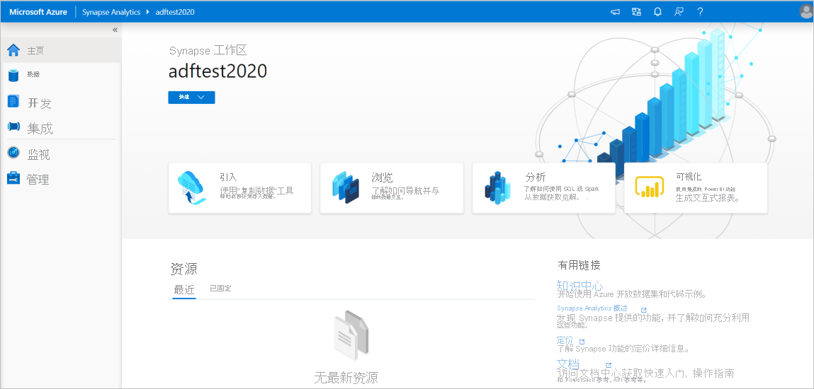

# <a name="quickstart-transform-data-using-mapping-data-flows"></a>快速入门：使用映射数据流转换数据

在本快速入门中，将使用 Azure Synapse Analytics 创建一个管道，该管道使用映射数据流将数据从 Azure Data Lake Storage Gen2 (ADLS Gen2) 源转换为 ADLS Gen2 接收器。 使用映射数据流转换数据时，可以使用本快速入门中的配置模式进行扩展

在本快速入门中，请执行以下步骤：

> [!div class="checklist"]
> * 使用 Azure Synapse Analytics 中的数据流活动创建管道。
> * 使用四个转换构建映射数据流。
> * 测试性运行管道。
> * 监视数据流活动

## <a name="prerequisites"></a>先决条件

* **Azure 订阅**：如果没有 Azure 订阅，请在开始之前创建一个 [免费帐户](https://azure.microsoft.com/free/)。
* **Azure Synapse 工作区**：按照 [快速入门：创建 Synapse 工作区](quickstart-create-workspace.md)中的说明创建 Synapse 工作 Azure 门户区。
* **Azure 存储帐户**：将 ADLS 存储用作 *源* 和 *接收器* 数据存储。 如果没有存储帐户，请参阅[创建 Azure 存储帐户](../storage/common/storage-account-create.md)以获取创建步骤。

    本教程中我们要转换的文件是 MoviesDB.csv 的，可在 [此处](https://raw.githubusercontent.com/djpmsft/adf-ready-demo/master/moviesDB.csv)找到。 若要从 GitHub 检索该文件，请将内容复制到所选的文本编辑器，以将本地保存为 .csv 文件。 若要将文件上传到存储帐户，请参阅 [上传 Azure 门户的 blob](../storage/blobs/storage-quickstart-blobs-portal.md)。 这些示例将引用名为 "sample data" 的容器。

### <a name="navigate-to-the-synapse-studio"></a>导航到 Synapse Studio

创建 Azure Synapse 工作区后，可以通过两种方式打开 Synapse Studio：

* 在 [Azure 门户](https://ms.portal.azure.com/#home)中打开 Synapse 工作区。 在 "入门" 下的打开 Synapse Studio 卡上选择 " **打开** "。
* 打开 [Azure Synapse Analytics](https://web.azuresynapse.net/) 并登录到工作区。

在本快速入门中，我们将使用名为“adftest2020”的工作区作为示例。 它将自动导航到 Synapse Studio 主页。



## <a name="create-a-pipeline-with-a-data-flow-activity"></a>使用数据流活动创建管道

管道包含用于执行一组活动的逻辑流。 在本部分中，你将创建一个包含数据流活动的管道。

1. 转到“集成”选项卡。选择管道标题旁边的加号图标，然后选择“管道”。

   

1. 在管道的 "**属性**" 设置页中，为 "**名称**" 输入 **TransformMovies** 。

1. 在 "*活动*" 窗格中的 "*移动和转换*" 下，将 "数据流" 拖到管道 **画布上。**

1. 在 "**添加** 数据流" 页面中，选择 "**创建新** 的数据流  ->  **数据流**"。 完成后单击“确定”。

   

1. 在 "**属性**" 页上，将数据流命名为 **TransformMovies** 。

## <a name="build-transformation-logic-in-the-data-flow-canvas"></a>在数据流画布中生成转换逻辑

创建数据流后，会自动将其发送到数据流画布。 在此步骤中，你将生成一个数据流，该数据流在 ADLS 存储中使用 MoviesDB.csv，并将 comedies 的平均评级从1910到2000。 然后，将此文件写回到 ADLS 存储。

1. 在 "数据流" 画布上方，将 "数据流 **调试** " 滑块滑动到上。 调试模式允许针对实时 Spark 群集对转换逻辑进行交互式测试。 数据流群集需要5-7 分钟才能预热，如果用户计划进行数据流开发，则建议先启用调试。 有关详细信息，请参阅[调试模式](https://docs.microsoft.com/azure/data-factory/concepts-data-flow-debug-mode?toc=/azure/synapse-analytics/toc.json&bc=/azure/synapse-analytics/breadcrumb/toc.json)。

    

1. 在 "数据流" 画布中，通过单击 " **添加源** " 框来添加源。

1. 将源命名为 **MoviesDB**。 单击 " **新建** " 以创建新的源数据集。

    

1. 选择 **Azure Data Lake Storage Gen2**。 单击“继续”(Continue)。

    

1. 选择 **DelimitedText**。 单击“继续”(Continue)。

1. 将数据集命名为 **MoviesDB**。 在 "链接服务" 下拉列表中，选择 " **新建**"。

1. 在 "链接的服务创建" 屏幕中，将 ADLS Gen2 链接服务命名为 **ADLSGen2** ，并指定身份验证方法。 然后输入连接凭据。 在本快速入门中，我们将使用帐户密钥连接到存储帐户。 可以单击 " **测试连接** " 以验证输入的凭据是否正确。 完成后，单击“创建”。

    

1. 返回数据集创建屏幕后，请在 " **文件路径** " 字段下输入文件所在的位置。 在本快速入门中，"MoviesDB.csv" 文件位于 "示例数据" 容器中。 如果文件具有标题，请选中 **第一行作为标题**。 **从 "连接"/"存储**" 中选择 "直接从存储中的文件导入标头架构"。 完成后单击“确定”。

    

1. 如果调试群集已启动，请转到源转换的 " **数据预览** " 选项卡，然后单击 " **刷新** " 以获取数据的快照。 您可以使用数据预览来验证是否已正确配置转换。

    

1. 在 "数据流" 画布上的源节点旁边，单击加号图标以添加一个新转换。 要添加的第一个转换是 **筛选器**。

    

1. 将筛选器转换命名为 **FilterYears**。 单击 " **筛选"** 旁边的 "表达式" 框以打开 "表达式生成器"。 在此处指定筛选条件。

1. 数据流表达式生成器允许以交互方式生成要在各种转换中使用的表达式。 表达式可以包含内置函数、输入架构中的列和用户定义的参数。 有关如何生成表达式的详细信息，请参阅 [Data Flow expression builder](https://docs.microsoft.com/azure/data-factory/concepts-data-flow-expression-builder?toc=/azure/synapse-analytics/toc.json&bc=/azure/synapse-analytics/breadcrumb/toc.json)。

    在本快速入门中，你想要筛选在1910年到2000年之间出现的流派喜剧的电影。 由于 year 目前是一个字符串，因此需要使用函数将其转换为整数 ```toInteger()``` 。 使用大于或等于 ( # B0 =) ，并小于或等于 ( # B1 =) 运算符来与文本年份值1910和200进行比较。 将这些表达式与和 ( # A2) 运算符一起结合。 表达式如下所示：

    ```toInteger(year) >= 1910 && toInteger(year) <= 2000```

    若要确定哪些电影是 comedies 的，可以使用 ```rlike()``` 函数查找列流派中的 "喜剧" 模式。 将 rlike 表达式与 year 比较以获取：

    ```toInteger(year) >= 1910 && toInteger(year) <= 2000 && rlike(genres, 'Comedy')```

    

    如果调试群集处于活动状态，则可以通过单击 " **刷新** " 来验证逻辑，以查看表达式输出与使用的输入进行比较。 有多个正确答案可以帮助你如何使用数据流表达式语言来完成此逻辑。

    完成表达式后，单击 " **保存并完成** "。

1. 提取 **数据预览** ，验证筛选器是否正常工作。

1. 要添加的下一个转换是 **架构修饰符** 下的 **聚合** 转换。

    

1. 将聚合转换命名为 **AggregateComedyRatings**。 在 " **分组依据** " 选项卡中，从下拉列表中选择 " **年** "，以便按电影的年份对聚合分组。

    

1. 请参阅 " **聚合** " 选项卡。在左侧文本框中，将聚合列命名为 **AverageComedyRating**。 单击右侧的 "表达式" 框，通过表达式生成器输入聚合表达式。

    

1. 若要获取列 **分级** 的平均值，请使用 ```avg()``` 聚合函数。 由于 " **分级** " 是一个字符串并 ```avg()``` 采用数字输入，因此必须通过函数将该值转换为数字 ```toInteger()``` 。 此表达式如下所示：

    ```avg(toInteger(Rating))```

    完成后，单击 " **保存并完成** "。

    

1. 转到 " **数据预览** " 选项卡以查看转换输出。 请注意，只有两列是 " **年** " 和 " **AverageComedyRating**"。

    

1. 接下来，您需要在 "**目标**" 下添加 **接收器** 转换。

    

1. 命名接收器 **接收器**。 单击 " **新建** " 以创建接收器数据集。

1. 选择 **Azure Data Lake Storage Gen2**。 单击“继续”(Continue)。

1. 选择 **DelimitedText**。 单击“继续”(Continue)。

1. 将接收器数据集命名为 **MoviesSink**。 对于 "链接服务"，请选择在步骤7中创建的 ADLS Gen2 链接服务。 输入要向其写入数据的输出文件夹。 在本快速入门中，我们将写入 "示例-数据" 容器中的文件夹 "输出"。 文件夹不需要事先存在，可以动态创建。 将 **第一行设置为标头** 为 true，并为 **导入架构** 选择 "**无**"。 完成后单击“确定”。

    

现在，您已经完成了数据流的构建。 你已准备好在管道中运行它。

## <a name="running-and-monitoring-the-data-flow"></a>运行和监视数据流

可以在发布管道之前对其进行调试。 在此步骤中，将触发数据流管道的 "调试" 运行。 当数据预览不写入数据时，调试运行会将数据写入接收器目标。

1. 中转到管道画布。 单击 " **调试** " 以触发调试运行。

    

1. 数据流活动的管道调试使用活动调试群集，但至少需要一分钟的时间来初始化。 可以通过 " **输出** " 选项卡跟踪进度。运行成功后，单击 "眼镜" 图标打开 "监视" 窗格。

    

1. 在 "监视" 窗格中，可以查看每个转换步骤中的行数和所用的时间。

    

1. 单击转换可获取有关数据的列和分区的详细信息。

    

如果已正确执行此快速入门，应将83行和2列写入接收器文件夹中。 可以通过检查 blob 存储来验证数据。


## <a name="next-steps"></a>后续步骤

转到以下文章，了解 Azure Synapse Analytics 支持：

> [!div class="nextstepaction"]
> [管道和活动](https://docs.microsoft.com/azure/data-factory/concepts-pipelines-activities?toc=/azure/synapse-analytics/toc.json&bc=/azure/synapse-analytics/breadcrumb/toc.json) 
> [映射数据流概述](https://docs.microsoft.com/azure/data-factory/concepts-data-flow-overview?toc=/azure/synapse-analytics/toc.json&bc=/azure/synapse-analytics/breadcrumb/toc.json) 
> 数据流[表达式语言](https://docs.microsoft.com/azure/data-factory/data-flow-expression-functions?toc=/azure/synapse-analytics/toc.json&bc=/azure/synapse-analytics/breadcrumb/toc.json)
