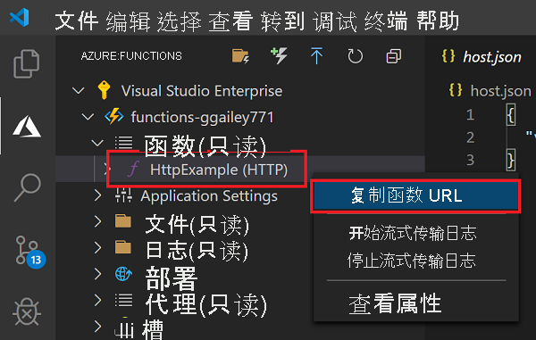

## <a name="run-the-function-in-azure"></a>在 Azure 中运行函数

1. 返回到“Azure：函数”函数”区域，在你的订阅下展开新的函数应用。 展开“函数”，在“HttpExample”中右键单击“(Windows)”或者在按住 <kbd>Ctrl</kbd> 的同时单击“(macOS)”，然后选择“复制函数 URL”  。

    

1. 将 HTTP 请求的此 URL 粘贴到浏览器的地址栏中，将 `name` 查询字符串以 `?name=Functions` 形式添加到此 URL 的末尾，然后执行请求。 调用 HTTP 触发的函数的 URL 应采用以下格式：

    ```http
    http://<FUNCTION_APP_NAME>.azurewebsites.net/api/httpexample?name=Functions
    ```

    以下示例演示浏览器中函数返回的对远程 GET 请求的响应：

    
